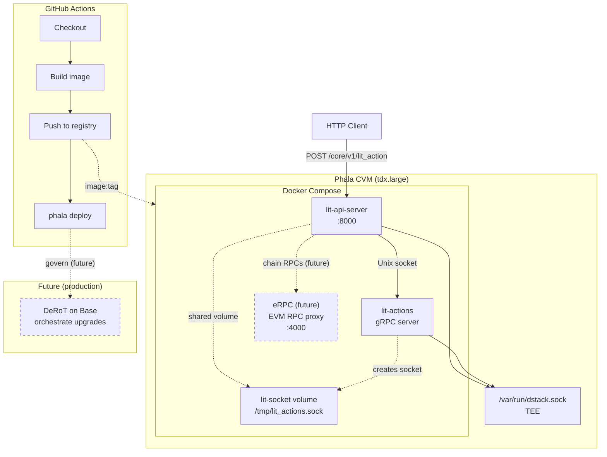

# Deployment

This document describes how to deploy the Lit node stack (`lit-api-server` and `lit-actions`) to Phala Cloud using the smallest available CVM instance.

## Overview

The deployment uses:

- **GitHub Actions** — CI/CD workflow triggered on push to `main` or manual dispatch
- **Docker** — Multi-stage build producing both binaries in a single image
- **Docker Compose** — Two services sharing a Unix socket for gRPC communication
- **Phala Cloud** — Confidential Virtual Machine (CVM) with TEE, instance type `tdx.large`

## Architecture



## Files

| File | Purpose |
|------|---------|
| [requirements.md](requirements.md) | One-time CVM verification — requirements |
| [PLAN.md](PLAN.md) | Implementation plan (traceability to requirements) |
| [PLAN-phase-1.md](PLAN-phase-1.md) through [PLAN-phase-4.md](PLAN-phase-4.md) | Per-phase plans with parallelizable workflows |
| `.github/workflows/deploy-phala.yml` | GitHub Actions workflow |
| `Dockerfile.phala` | Multi-stage build for both binaries |
| `docker-compose.phala.yml` | Service definitions and shared socket volume |
| `.dockerignore` | Excludes build artifacts from Docker context |

## Build

The `Dockerfile.phala` produces a single image containing:

- `lit_actions` — Lit Actions gRPC server (Deno-based JS runtime)
- `lit-api-server` — Rocket HTTP API server (built with `phala` feature for attestation)

Both run as separate containers in the same CVM, communicating via a shared Unix socket at `/tmp/lit_actions.sock`.

### Phala attestation

Attestation (quote, event_log, vm_config) is obtained from the gateway `/.dstack/` endpoints—the gateway is the required ingress and the single attestation source. Do not implement an app-level attestation endpoint. For dev: Phala-hosted gateway; for local testing: dstack simulator (`DSTACK_SOCKET`). See [PLAN.md](PLAN.md) and [requirements.md](requirements.md) for the verification flow.

## Required Secrets

Configure these in **Settings → Secrets and variables → Actions**:

| Secret | Description |
|--------|-------------|
| `PHALA_CLOUD_API_KEY` | From [Phala Cloud Dashboard](https://cloud.phala.network/dashboard) → Avatar → API Tokens |
| `DOCKERHUB_USERNAME` (variable) | Docker Hub username |
| `DOCKER_IMAGE` (variable) | Full image path, e.g. `docker.io/username/lit-node-express` |
| `PHALA_APP_NAME` (variable) | CVM name, e.g. `lit-api-server` |
| `DOCKERHUB_TOKEN` (secret) | Docker Hub PAT (Account Settings > Security > Access Tokens) |

## Workflow Steps

1. **Checkout** — Clone the repository
2. **Log in to registry** — Authenticate with Docker Hub or GHCR
3. **Build and push** — Build the image, tag with a unique UUID, and push
4. **Prepare compose** — Substitute `${DOCKER_IMAGE}` with the built image tag
5. **Deploy** — Run `phala deploy` with `--instance-type tdx.large`

## Manual Deployment

Using [just](https://github.com/casey/just) (recommended):

```bash
just setup       # optional: install Phala CLI (requires npm)
just deploy      # builds with UUID tag, pushes to registry, and deploys that image
```

**Prerequisites:** Log in to Docker Hub (`docker login`) and ensure you have push access to `litptcl/lit-node-express`. The deploy command updates an existing CVM by name; for first-time deploy when no CVM exists, use `just deploy-new`.

Override with `DOCKER_IMAGE` (repo path without tag) or `DOCKER_TAG` (to pin a specific build):

```bash
DOCKER_IMAGE=ghcr.io/owner/lit-node-express just deploy
DOCKER_TAG=abc123-def456 just deploy   # deploy a specific tag
```

Or run the commands directly (after `docker login` and `phala login`):

```bash
# Build with UUID tag, push, and deploy
TAG=$(uuidgen | tr '[:upper:]' '[:lower:]')
docker build -f Dockerfile.phala -t litptcl/lit-node-express:$TAG .
docker push litptcl/lit-node-express:$TAG
sed "s|\${DOCKER_IMAGE}|litptcl/lit-node-express:$TAG|g" docker-compose.phala.yml > docker-compose.deploy.yml
phala deploy -c docker-compose.deploy.yml -n lit-api-server --instance-type tdx.large
```

Environment variables: `DOCKER_IMAGE` (default: `litptcl/lit-node-express`, repo path without tag), `DOCKER_TAG` (default: auto-generated UUID), `PHALA_APP_NAME` (default: `lit-api-server`), `PHALA_INSTANCE_TYPE` (default: `tdx.large`).

## Instance Type

The workflow uses `tdx.large`. For custom sizing:

```bash
phala deploy --vcpu 1 --memory 2048MB --disk-size 40GB ...
```

## Integration Testing

Use [Grafana k6](https://grafana.com/docs/k6/latest/) to run integration tests against the deployed API. The script exercises user flows: get chain config, get Lit Action IPFS ID, and execute a simple Lit Action that returns "Hello World!".

**Prerequisites:** Install k6 ([install guide](https://grafana.com/docs/k6/latest/set-up/install-k6/)).

```bash
just k6-test
```

Or with a custom base URL:

```bash
BASE_URL=https://your-instance.phala.network just k6-test
```

The k6 tests create a new account via `new_account` in each run; this requires the AccountConfig contract to be deployed and configured on the chain (e.g. Base Sepolia).

## Phala Networking

Phala Cloud offers several networking options when scaling a service to multiple CVMs.

This deployment uses the **built-in gateway** for automated load balancing and simplicity.

### Built-in Gateway (Current Choice)

The Phala gateway terminates TLS and load-balances traffic across CVM instances. We use this for zero-configuration deployment.

**Session handling:** There is no session affinity. Each request may hit a different instance.

**WebSocket connections:** The TCP connection stays with one instance for its lifetime, but reconnections may hit a different instance.

### Other Options

- **API Gateway pattern** — Run a CVM as an API gateway that proxies to backend CVMs. Use when you need customized routing, centralized auth, or routing logic under your control. See [Phala Architecture: API Gateway Pattern](https://docs.phala.com/phala-cloud/networking/architecture#api-gateway-pattern).
- **TLS passthrough / custom domains** — For end-to-end TLS or custom domain attestation; requires dstack-ingress in your CVM.

We stick to the built-in gateway for automated load balancing and deployment simplicity.

### Custom Domain Redirect

We use a simple HTTP redirect from `*.litprotocol.com` to the Phala gateway domain (`*.phala.network`). Users visiting the litprotocol.com URL are redirected to the CVM's Phala endpoint; TLS terminates at the Phala gateway. The custom domain is a convenience shortcut during development and INSECURE — users must verify attestation at the gateway's `/.dstack/` endpoints on the final `*.phala.network` URL but see [CPL-5: Use Custom domain on CVM security flow for dev.chipotle.litprotocol.com](https://linear.app/litprotocol/issue/CPL-5/use-custom-domain-on-cvm-security-flow-for-devchipotlelitprotocolcom) on how to fix this.

## Current Limitations

- **No autoscaling** — Phala CVM autoscaling is not currently configured; the deployment runs a fixed instance.
- **No chain RPCs** — Chain RPC endpoints are not provided for this deployment; configure external RPCs as needed.

## Future Integrations (Tentative)

**[eRPC](https://github.com/erpc/erpc)** — fault-tolerant EVM RPC proxy and re-org aware caching solution. A future, optional third-party service that could be added as a Docker Compose service to provide chain RPC endpoints for this deployment. eRPC offers retries, circuit breakers, failovers, rate limiting, and a unified dashboard. Integration is not planned or implemented; this is a placeholder for potential future work.

## Orchestration: Development vs Released

| Environment | Orchestration |
|-------------|---------------|
| **Development** | Simulator — local TEE simulator for development. |
| **Released** | Either Phala Cloud or [DeRoT](https://docs.phala.com/dstack/design-documents/decentralized-root-of-trust) on Base, selected via Cargo feature flags: `pcloud` (Phala Cloud) or `derot` (on-chain governance on Base). |
