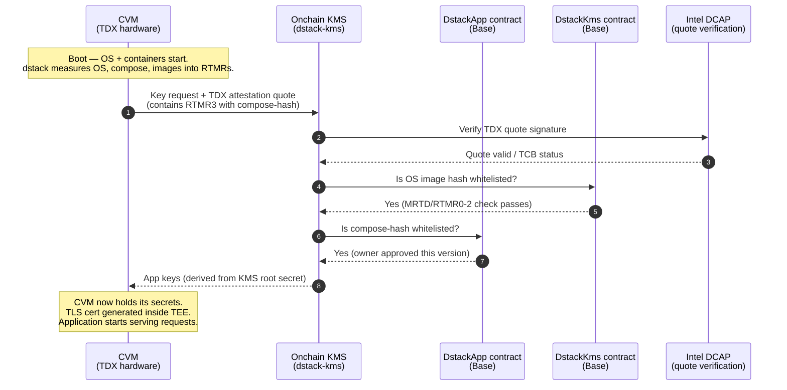

# Key Issuance from DeRoT (Onchain KMS)

How a CVM obtains its application keys from the Decentralized Root of Trust on Base.

DeRoT uses an **Onchain KMS** where a DstackKms contract on Base holds the KMS root CA, and a
per-application DstackApp contract holds the compose-hash whitelist. The KMS will only issue keys
to CVMs whose attested code is whitelisted by the app owner.

## Flow

## Components

| Component | Role |
|-----------|------|
| **TDX hardware** | Hardware root of trust; measures everything into RTMR registers at boot |
| **dstack OS** | Hashes OS + kernel + boot params into MRTD/RTMR0-2; hashes docker-compose (with pinned image digests) into RTMR3 |
| **Onchain KMS** | dstack-kms service; verifies attestation quote; checks on-chain whitelists before issuing keys |
| **DstackKms (Base)** | Contract holding whitelisted OS image hashes and KMS aggregated MR |
| **DstackApp (Base)** | Per-application contract; owner controls which compose-hashes are authorized; `0x2f83172A49584C017F2B256F0FB2Dca14126Ba9C` |

## Key Points

- **No whitelist → no keys.** If the compose-hash is not in DstackApp, the KMS refuses key issuance, and the CVM cannot start serving.
- **Image digests must be pinned.** `docker-compose` must use `@sha256:` digests; mutable tags like `:latest` produce a non-deterministic compose-hash that won't match any whitelist entry.
- **Key derivation is deterministic.** The same attested code always gets the same derived keys, so data encrypted by one CVM instance is readable by a later instance running the same code.
- **Owner controls governance.** The DstackApp `owner` (wallet, multisig, timelock, or DAO) is the sole entity that can whitelist new compose-hashes.

## References

- [Phala: Cloud vs Onchain KMS](https://docs.phala.com/phala-cloud/key-management/cloud-vs-onchain-kms)
- [Phala: DeRoT design](https://docs.phala.com/dstack/design-documents/decentralized-root-of-trust)
- [requirements.md FR-2, FR-2.6](planning/requirements.md)
- [PLAN.md — Onchain KMS on Base](planning/PLAN.md)
