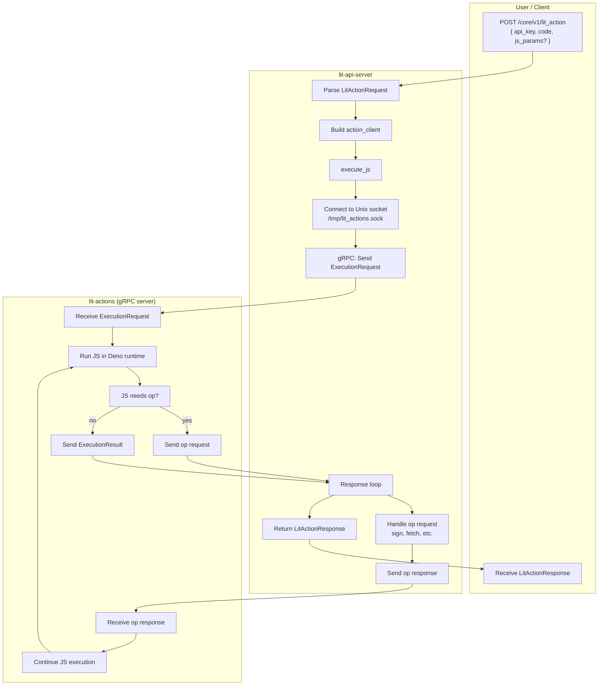

# ExecuteJs Flow

Flowchart of a user calling the Lit Action execution endpoint to run JavaScript code.

## Endpoint

- **HTTP:** `POST /core/v1/lit_action`
- **Request:** `{ api_key: string, code: string, js_params?: object }`
- **Response:** `{ signatures, response, logs, has_error }`

## Flowchart

## Steps

1. **User** sends `POST /core/v1/lit_action` with JSON `{ api_key, code, js_params? }`.
2. **lit-api-server** parses the request and builds an `action_client::Client`.
3. **action_client.execute_js** connects to the lit-actions gRPC server via Unix socket at `/tmp/lit_actions.sock`.
4. **Client** sends an `ExecutionRequest` (code + globals) over the bidirectional gRPC stream.
5. **lit-actions** receives the request and runs the JavaScript in a sandboxed Deno environment.
6. **Op loop:** If the JS calls a Lit Action op (e.g. `Lit.Actions.signEcdsa`, `Lit.Actions.callContract`, fetch), the server sends an op request to the client. The client handles it (using secrets, HTTP, etc.) and returns the response. The server continues execution.
7. **lit-actions** sends `ExecutionResult` (success, response, logs) when the JS completes.
8. **lit-api-server** returns `LitActionResponse` to the user.
