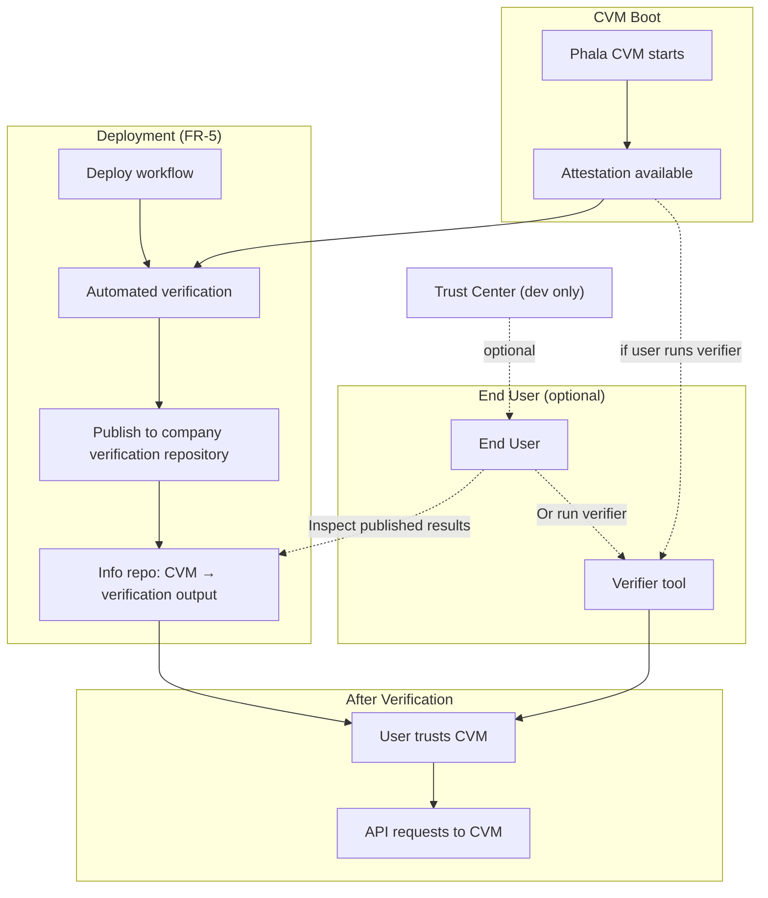
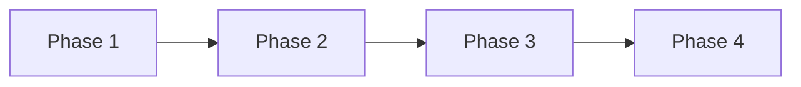

# Verifiable Clean Bill of Execution — Implementation Plan

**Source of truth**: [requirements.md](requirements.md)

## Context

Each lit-api-server runs on a Phala CVM. **Automated verification** (company-run, post-deployment) uses the verifier tool and publishes results. End users MAY optionally run the verifier themselves; they may also trust the published results. After verification, the TLS certificate serves as a **trust anchor**; subsequent connections validate the presented cert (e.g. certificate pinning). No per-request attestation.

**Custom domain as trust anchor**: The company domain MUST be the end-user target. TLS terminates at the custom domain with a TEE-controlled certificate. No redirect pattern that places the custom domain outside the chain.

**Avoid cloud vendor lock-in in production** (NFR-2.1, NFR-2.2): Phala Cloud is acceptable for development. Production deployments SHALL depend on open dstack components only—not Phala-exclusive infrastructure or tooling. This ensures production can run on any dstack-compatible platform (e.g. DeRoT, self-hosted).

**Onchain KMS required for production** ([Cloud vs Onchain KMS](https://docs.phala.com/phala-cloud/key-management/cloud-vs-onchain-kms)): Production SHALL use Onchain KMS on Base. Blockchain smart contracts (DstackApp) enforce authorization; no single entity controls governance. Cloud KMS is acceptable for development only.

### Dev vs Production (NFR-2)

| Aspect | Development | Production |
|--------|--------------|------------|
| **Attestation** | App exposes `/attestation` and `/info` (quote, event_log, vm_config, report_data, app_compose). Gateway cannot serve attestation—it must come from the application. |
| **Gateway** | Phala Cloud (Phala-hosted) | Our own dstack-gateway instance (DSTACK; OK for production) |
| **RoT / KMS** | `pcloud` (Cloud KMS; dev only) | **Onchain KMS on Base** (`derot`; DstackApp contract) or self-hosted |
| **Verifier deps** | dcap-qvl, dstack-mr | dcap-qvl, dstack-mr (no Phala Cloud API) |
| **Trust Center** | Optional reference | Not used; company verification repo only |
| **Deploy target** | Phala Cloud | DeRoT, self-hosted, any dstack-compatible |

**Custom domain in production** = running our own gateway instance. The gateway is part of DSTACK; it is OK to depend on DSTACK in production.

**Gateway is required ingress** in DeRoT production. The gateway handles TLS and routing but **cannot serve attestation** (quote, event_log, vm_config, report_data)—per [Phala Get Attestation](https://docs.phala.com/phala-cloud/attestation/get-attestation), the application must expose `/attestation` and `/info` endpoints. The app fetches from the dstack socket and serves attestation for verifiers.

### Onchain KMS on Base (Production)

Production deployments use [Onchain KMS](https://docs.phala.com/phala-cloud/key-management/cloud-vs-onchain-kms) with DstackApp on Base. Key parameters:

| Parameter | Value |
|-----------|-------|
| **Contract (Base)** | `0x2f83172A49584C017F2B256F0FB2Dca14126Ba9C` |
| **RPC** | `https://kms.dstack-base-prod7.phala.network` (and prod8, prod9) |
| **Governance** | DstackApp `owner` controls compose-hash whitelist; set to multisig, timelock, or DAO for collective control |

Phase 1: Deploy DstackApp (or use shared contract); create Phala Cloud app with "Onchain KMS" selected; build lit-api-server with `derot` feature.

## Architecture

## Implementation Plan by Requirement

### FR-1: Verification Capability

| Req | Task |
|-----|------|
| FR-1.1 | Expose attestation data (quote, event_log, vm_config, report_data) via app endpoints. **lit-api-server** implements `/attestation` and `/info` per [Phala Get Attestation](https://docs.phala.com/phala-cloud/attestation/get-attestation). Gateway cannot serve attestation—it must come from the application. Trust Center is Phala-exclusive (dev only). |
| FR-1.2 | Expose app_compose or compose-hash for code authentication, or document `--expected-compose-hash` fallback. |
| FR-1.3 | Ensure verifier can perform verification when attestation is obtained via chosen mechanism. |

### FR-2: KMS / Root of Trust Configurability

| Req | Task |
|-----|------|
| FR-2.1–2.4 | KMS/RoT configurable at compile time (Cargo features). **Production**: Onchain KMS on Base (`derot`; DstackApp contract). `pcloud` (Cloud KMS) for dev only. |
| FR-2.5 | Support dstack simulator (e.g. `DSTACK_SIMULATOR_ENDPOINT`) for local testing. |
| FR-2.6 | Production SHALL use Onchain KMS on Base; DstackApp contract deployment and app creation configured for blockchain-enforced governance. |

### FR-3: Custom Domain Support

| Req | Task |
|-----|------|
| FR-3.1–3.4 | Custom domain as end-user target and trust anchor. Production = our own dstack-gateway instance (DSTACK). TLS passthrough / dstack-ingress; no redirect. |

### FR-4: Complete Chain of Trust Verifier Tool

| Req | Task |
|-----|------|
| FR-4.1 | Verifier accepts attestation via base_url (app URL; fetches from `/attestation` and `/info`) or directly (quote, event_log, app_compose, `--expected-compose-hash`). |
| FR-4.2 | Verifier implements ALL steps from [Complete Verification Checklist](https://docs.phala.com/phala-cloud/attestation/chain-of-trust#complete-verification-checklist). |
| FR-4.3 | Support `--skip-*` flags for partial verification. |
| FR-4.4 | Link to Trust Center in output (optional; dev/Phala Cloud only; omit for production per NFR-2). |
| FR-4.5 | One-time use design. |

**Verifier implementation** — build `verify-cvm` based on [dstack-verifier](https://github.com/Dstack-TEE/dstack/tree/master/verifier) (Dstack-TEE/dstack, Apache-2.0):

- **Base (dstack-verifier)**: Quote verification (dcap-qvl), event log, OS image hash, TCB status, app_info (compose hash) — VR-1, VR-2 core
- **Extend (verify-cvm)**: VR-3 Network (TLS fingerprint, evidence binding, CAA, cert chain); VR-4 Governance (DstackApp, DstackKms); base_url fetch; `--skip-*` flags

**Dependencies (NFR-2)**: dstack-verifier (open, Apache-2.0) as base; dcap-qvl, dstack-mr via dstack-verifier. Phala Cloud API is Phala-exclusive—dev only. Run via `cargo run -p verify-cvm -- [args]`.

### FR-5: Company Verification Repository

| Req | Task |
|-----|------|
| FR-5.1 | Run automated verification of each new CVM after deployment. |
| FR-5.2 | Publish verification results (pass/fail per step, attestation summary) to company-maintained info repository. |
| FR-5.3 | Associate each CVM (app-id, custom domain, or deployment id) with its verification output. |
| FR-5.4 | Deploy workflow triggers verification and publishing as post-deployment automation. |

**Implementation**: Add verification step to deploy workflow (e.g. GitHub Action after CVM is live). Run verifier crate (`cargo run -p verify-cvm`); capture output; publish to repository (e.g. static site, API, or docs).

### DR-1: Docker Image Pinning

| Req | Task |
|-----|------|
| DR-1.1, DR-1.2 | Use `@sha256:` digests in docker-compose; deploy workflow pins images by digest. |

### DR-1b: Container Provenance (Sigstore)

| Req | Task |
|-----|------|
| Image provenance | Add Sigstore signing to GitHub Actions container builds. Links image digests to source code via GitHub-endorsed builds. See [Phala: Verify Your Application — Image Provenance](https://docs.phala.com/phala-cloud/attestation/verify-your-application#image-provenance). |

### DR-2: Documentation

| Req | Task |
|-----|------|
| DR-2.1 | Describe one-time CVM verification trust model. |
| DR-2.2 | Document Complete Chain of Trust steps and how to run verifier. |
| DR-2.3 | Reference attestation endpoints. App `/attestation` and `/info` are the attestation source; Trust Center optional (dev). |
| DR-2.4 | Stay in sync with Orchestration and DeRoT sections. |
| DR-2.5 | Document custom domain setup (trust anchor, TLS passthrough). |
| DR-2.6 | Document company verification repository: access, how outputs are published, how to interpret results. |

## Phased Implementation

Each phase has its own plan with workflow details, files, and exit criteria. All phases respect NFR-2: production uses open dstack only; Phala Cloud for dev.

| Phase | Plan | Goal |
|-------|------|------|
| **1** | [PLAN-phase-1.md](PLAN-phase-1.md) | Prerequisites & Configuration — app `/attestation` and `/info` endpoints, digest pinning, **Sigstore** for container provenance, **Onchain KMS on Base** (DstackApp; prod), Cloud KMS (dev). Custom domain deferred to Phase 4. |
| **2** | [PLAN-phase-2.md](PLAN-phase-2.md) | Verifier Crate — based on dstack-verifier (Dstack-TEE/dstack); extend VR-3, VR-4 (incl. DstackApp/DstackKms on Base) |
| **3** | [PLAN-phase-3.md](PLAN-phase-3.md) | Verification Automation — dev + production deploy paths (Onchain KMS app creation) |
| **4** | [PLAN-phase-4.md](PLAN-phase-4.md) | Documentation — dev vs production paths, Onchain KMS setup |

### Phase Dependency Graph

---

## Files to Create/Modify

| File | Action | Requirements |
|------|--------|--------------|
| lit-api-server `/attestation`, `/info` | Implement — app must expose attestation; gateway cannot serve it | FR-1.1, FR-1.2 |
| `verify-cvm/` (Rust crate) | Create — based on dstack-verifier; extend VR-3, VR-4 | FR-4, VR-1–VR-4 |
| `verify-cvm/README.md` | Create | FR-4, DR-2.2 |
| Deploy workflow(s) | Modify — add post-deploy verification + publish (dev: deploy-phala; prod: DeRoT/self-hosted when available) | FR-5.1, FR-5.4 |
| Company verification repository | Create/configure | FR-5.2, FR-5.3 |
| `docs/deployment/deployment.md` | Modify — One-Time CVM Verification, custom domain, verification repository | DR-2.1–DR-2.6 |
| `docker-compose.phala.yml` or deploy workflow | Modify — pin images by digest | DR-1.1, DR-1.2 |
| `.github/workflows/deploy-phala.yml` | Modify — add Sigstore signing for container provenance | DR-1b |

## Verification Flow Summary

1. **Deployment**: CVM deploys; attestation becomes available.
2. **Automated verification (FR-5)**: Deploy workflow runs the verifier tool, publishes results to company info repository. This is the primary verification path.
3. **End user (optional)**: User may inspect published results OR optionally run the verifier themselves.
4. **Trust**: If verification passes, TLS cert is trust anchor. User pins cert; sends API requests.
5. **Trust Center** (dev/Phala Cloud only): `https://trust.phala.com/app/{app-id}` — optional reference. Production uses company verification repository only (NFR-2).

## Out of Scope

- Per-request attestation (NFR-3.1)
- Payment/billing (NFR-3.2)

## Future (NFR-4)

- On-chain proof of cleanness
- Trust authority attesting and recording results
- Users may self-verify OR trust on-chain record
