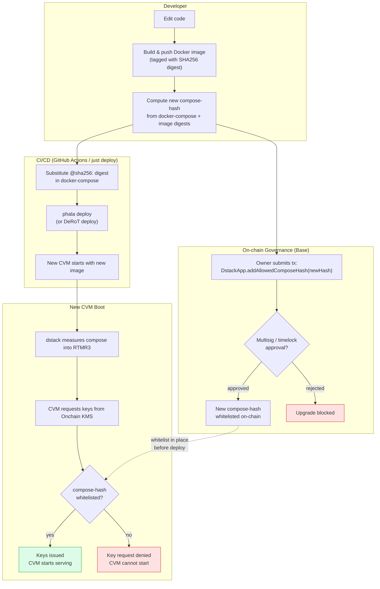

# Upgrading VM Code

How to safely roll out a new version of the CVM application — from code change through
on-chain governance approval to live traffic.

Because the Onchain KMS only issues keys to whitelisted code, every upgrade requires two
independent actions: **a governance tx** (whitelist the new compose-hash) and **a deployment** (push
the new image and restart the CVM). Neither alone is sufficient.

## Flow

## Steps

1. **Build & push** — CI builds the new Docker image and pushes it to the registry. The registry
   returns a `@sha256:` digest for the image.

2. **Compute compose-hash** — dstack hashes the full `docker-compose.yml` (with pinned image
   digests) to produce the compose-hash that will appear in RTMR3 at boot.

3. **Governance approval** — The DstackApp owner (wallet, multisig, or timelock) submits an
   on-chain transaction to whitelist the new compose-hash. A timelock or multisig introduces a
   mandatory delay, giving stakeholders time to review before the new code can receive keys.

4. **Deploy** — After the whitelist tx is confirmed, CI redeploys (`phala deploy` or DeRoT
   equivalent) with the new image digest substituted into docker-compose.

5. **Boot & key issuance** — The new CVM boots, dstack measures the compose into RTMR3, and the
   CVM requests keys from the Onchain KMS. The KMS verifies the attestation and checks the
   DstackApp whitelist (step 3). If the compose-hash matches, keys are issued and the CVM starts.

## Ordering Requirement

The governance tx **must be confirmed on-chain before the new CVM boots** and requests keys.
If the CVM boots before the whitelist tx is finalized, the KMS will reject the key request and
the CVM cannot serve traffic. The diagram shows the whitelist flowing into the key issuance check
to reflect this dependency.

## Rollback

To roll back, redeploy the previous image (whose compose-hash is already whitelisted). No
governance action is required if the old compose-hash was not removed from the whitelist.
To block a rolled-back version, the owner removes its compose-hash from DstackApp.

## References

- [derot-key-issuance.md](derot-key-issuance.md) — how keys are issued after deploy
- [deployment.md](deployment.md) — deploy workflow (`just deploy`, GitHub Actions)
- [requirements.md DR-1, FR-2.6](planning/requirements.md)
- [Phala: Cloud vs Onchain KMS](https://docs.phala.com/phala-cloud/key-management/cloud-vs-onchain-kms)
