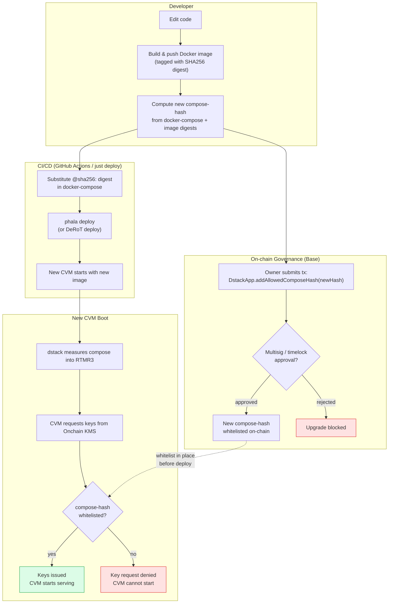

# Upgrading VM Code

How to safely roll out a new version of the CVM application — from code change through
on-chain governance approval to live traffic.

Because the Onchain KMS only issues keys to whitelisted code, every upgrade requires two
independent actions: **a governance tx** (whitelist the new compose-hash) and **a deployment** (push
the new image and restart the CVM). Neither alone is sufficient.

## Flow

```mermaid
flowchart TB
    subgraph Dev["Developer"]
        A["Edit code"] --> B["Build & push Docker image\n(tagged with SHA256 digest)"]
        B --> C["Compute new compose-hash\nfrom docker-compose + image digests"]
    end

    subgraph Governance["On-chain Governance (Base)"]
        D["Owner submits tx:\nDstackApp.addAllowedComposeHash(newHash)"]
        E{Multisig / timelock\napproval?}
        D --> E
        E -->|approved| F["New compose-hash\nwhitelisted on-chain"]
        E -->|rejected| X["Upgrade blocked"]
    end

    subgraph CI["CI/CD (GitHub Actions / just deploy)"]
        G["Substitute @sha256: digest\nin docker-compose"] --> H["phala deploy\n(or DeRoT deploy)"]
        H --> I["New CVM starts with new image"]
    end

    subgraph Boot["New CVM Boot"]
        I --> J["dstack measures compose into RTMR3"]
        J --> K["CVM requests keys from Onchain KMS"]
        K --> L{compose-hash\nwhitelisted?}
        L -->|yes| M["Keys issued\nCVM starts serving"]
        L -->|no| N["Key request denied\nCVM cannot start"]
    end

    C --> D
    C --> G
    F -.->|"whitelist in place\nbefore deploy"| L

    style X fill:#fee2e2,stroke:#dc2626
    style N fill:#fee2e2,stroke:#dc2626
    style M fill:#dcfce7,stroke:#16a34a
```

## Steps

1. **Build & push** — CI builds the new Docker image and pushes it to the registry. The registry
   returns a `@sha256:` digest for the image.

2. **Compute compose-hash** — dstack hashes the full `docker-compose.yml` (with pinned image
   digests) to produce the compose-hash that will appear in RTMR3 at boot.

3. **Governance approval** — The DstackApp owner submits an on-chain transaction to whitelist
   the new compose-hash. For the **production hosted deployment** this owner is a **2-of-4 Safe
   multisig** (`0xF688…1098`) with **no timelock** — an approved change takes effect as soon as a
   quorum executes it. Self-hosters can configure their own owner (wallet, higher-threshold
   multisig, timelock, or DAO) to add a mandatory review delay. What signers verify before
   approving (provenance via Sigstore, reproducible compose-hash, diff review) and the live
   governance facts are documented in the published
   [Upgrade Governance](../../docs/architecture/verification/upgrade-governance.mdx) page.

4. **Deploy** — After the whitelist tx is confirmed, CI redeploys (`phala deploy` or DeRoT
   equivalent) with the new image digest substituted into docker-compose.

5. **Boot & key issuance** — The new CVM boots, dstack measures the compose into RTMR3, and the
   CVM requests keys from the Onchain KMS. The KMS verifies the attestation and checks the
   DstackApp whitelist (step 3). If the compose-hash matches, keys are issued and the CVM starts.

## Ordering Requirement

The governance tx **must be confirmed on-chain before the new CVM boots** and requests keys.
If the CVM boots before the whitelist tx is finalized, the KMS will reject the key request and
the CVM cannot serve traffic. The diagram shows the whitelist flowing into the key issuance check
to reflect this dependency.

## Release-line branches & hotfixes

Every tagged production release (`v*` push → **Deploy Prod 1: Propose Compose Hash**) also
lands its commit on a minor-version **release-line branch** `release/vMAJOR.MINOR` (created by the
`create-release-branch` job). All patch releases on a line (`v1.2.0`, `v1.2.1`, …) share one
branch, so a shipped version has a stable home that does not move as `main` advances.

To ship a hotfix to a released version without dragging in unreleased work from `main`:

1. Fetch and branch from the release line:
   `git fetch origin && git switch -c release/v1.2 origin/release/v1.2` (or from the tag:
   `git fetch origin --tags && git switch --detach v1.2.3`).
2. Apply the fix (cherry-pick from `main` where possible so the fix also lands there).
3. Tag the patch and push: `git tag v1.2.4 && git push origin v1.2.4` — this re-runs the prod
   propose workflow for the hotfix commit.
4. The `create-release-branch` job **fast-forwards** `release/v1.2` to the hotfix commit. It never
   force-pushes: if the branch has diverged from the tagged commit it is left untouched and the run
   logs a warning, so hotfix commits already on the branch are never discarded.

Don't forget to forward-port the fix to `main` if you branched from the tag directly.

## Rollback

To roll back, redeploy the previous image (whose compose-hash is already whitelisted). No
governance action is required if the old compose-hash was not removed from the whitelist.
To block a rolled-back version, the owner removes its compose-hash from DstackApp.

## References

- [derot-key-issuance.md](derot-key-issuance.md) — how keys are issued after deploy
- [deployment.md](deployment.md) — deploy workflow (`just deploy`, GitHub Actions)
- [requirements.md DR-1, FR-2.6](planning/requirements.md)
- [Phala: Cloud vs Onchain KMS](https://docs.phala.com/phala-cloud/key-management/cloud-vs-onchain-kms)
