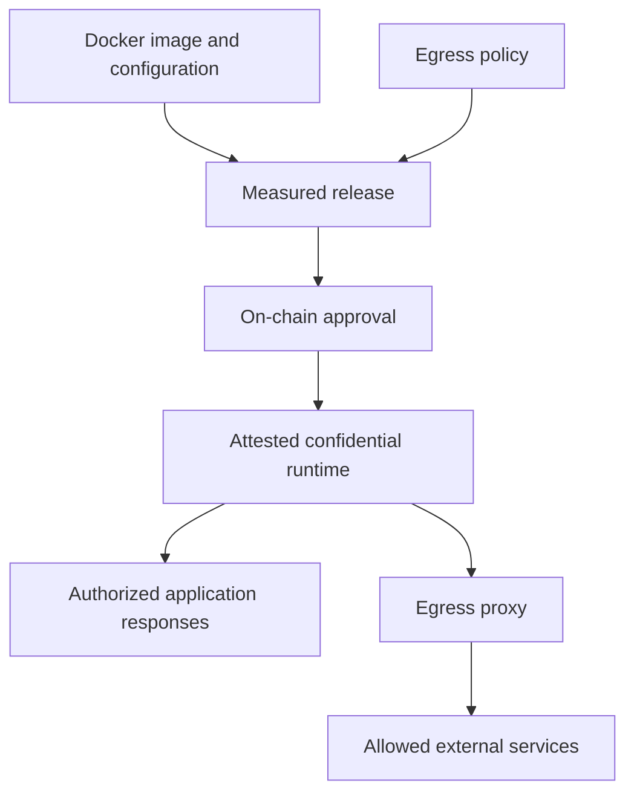

Run your AI workload in confidential hardware, with control over the software that runs and the services it can reach. Bring your own application or a vendor’s Docker container. Work with Lit to define the deployment, verify its runtime, and govern changes on-chain.

<Card title="Contact for Lit AI" icon="message" href="https://docs.google.com/forms/d/e/1FAIpQLSeIqxiiMLBgk-igTDU665Yx3UZsGrP_PgLUy9sh7sUx1mYyGg/viewform?usp=publish-editor" horizontal>
  Discuss private inference, training, fine-tuning, or an AI application that connects to your accounts and tools.
</Card>

<Note>
Work with the Lit team to assess model and hardware compatibility and arrange your deployment. The self-serve crypto dashboard and Lit Actions API are separate entry points.
</Note>

## How it works

A Docker container packages the application. A confidential virtual machine (CVM) provides the hardware-protected execution environment. Docker alone does not provide confidential computing.

The same method applies to first-party applications and vendor workloads. The deployment review covers the whole path: ingress, application, model, credentials, outbound connections, and returned results.

<Steps>
  <Step title="Pin the workload">
    Identify the Docker image by its SHA-256 digest, rather than a mutable tag. Declare configuration, service ports, secret names, storage needs, and network destinations. Image contents and model artifacts must be included in the verification plan; a model fetched later needs its own integrity check.
  </Step>
  <Step title="Measure the configuration">
    The deployment configuration includes the pinned images and egress policy. Its hash identifies the release. Changing the image or measured policy changes that identity.
  </Step>
  <Step title="Approve on-chain">
    The deployment’s approval rules authorize the measurement on-chain. Submitting a release proposal does not itself authorize it. Key release is gated by attestation and the approved measurements.
  </Step>
  <Step title="Verify and connect">
    Check the hardware attestation and measured release against the approval record. Verify the connection’s binding to the confidential runtime before sending sensitive data. Repeat verification when the release changes.
  </Step>
</Steps>

## Control outbound connections

**Egress** is traffic leaving the workload: model calls, database queries, tool requests, telemetry, downloads, and other outbound traffic.

The container method uses several controls together:

- **Network isolation.** The application sits on an internal network, without a direct route to external services.
- **A controlled exit.** Permitted outbound traffic passes through an egress proxy. The reviewed container implementation uses exact hostnames over TLS on port 443, rather than wildcard destinations or arbitrary IP addresses.
- **Destination and address checks.** The proxy checks the requested server name, resolves the destination, and blocks private or reserved address ranges.
- **Measured policy.** The egress rules are included in the measured deployment configuration. Broadening them is a release change requiring approval, not just a console setting.

An explicit empty allowlist supports a workload with no application-initiated outbound connections. It can still answer requests on its declared service ports. Supporting components such as certificate-management services need their own review; their network activity must not be confused with the application’s egress policy.

<Warning>
An allowed destination can receive data the application sends to it. A hostname allowlist does not inspect prompts, enforce an HTTP-path policy, or prevent disclosure in a response. Review application behavior, credentials, logs, and output rules alongside network policy. The container and egress proxy also depend on the security of their shared guest environment; do not assume a separate hardware boundary between them.
</Warning>

## Choose where the model runs

| Workload | What stays inside | What needs explicit review |
| --- | --- | --- |
| Inference in the confidential runtime | Model execution, prompts, and intermediate state within the agreed runtime boundary | Model integrity, hardware support, responses, and retention |
| Training or fine-tuning | Training data and computation within the agreed runtime boundary | Accelerator support, checkpoints, storage, and who receives the resulting model |
| An application calling an external model | The application and its credentials within the confidential runtime | The external provider receives the inputs sent to it; provider handling and retention remain relevant |
| An agent or tool gateway | Application logic and credentials within the confidential runtime | Which accounts and tools it may call, and what each destination may receive |

Confidentiality is a property of the execution environment. A model inherits the protections of the environment where it actually runs. Hosting an application in a TEE does not move an external model provider inside that boundary.

## Update code and policy on-chain

Software updates to Lit happen in public and on-chain. Only approved code can access runtime keys.

For a container deployment, a new image or egress policy produces a new measured release. Review that change, approve it through the deployment’s on-chain governance, and verify the resulting runtime. Previously approved measurements must be revoked if they should no longer be accepted. Approval of a release and deployment of that release are separate operations.

The approval record establishes authorization. Attestation establishes the identity of the running environment. Neither establishes that an application or model is correct. Container source can remain private; a digest identifies the artifact but does not replace review of its behavior.

<CardGroup cols={2}>
  <Card title="Attestation" icon="fingerprint" href="/architecture/verification/attestation">
    Understand what hardware evidence establishes.
  </Card>
  <Card title="On-chain approvals" icon="link" href="/architecture/verification/upgrade-governance">
    See how software approval and runtime key access connect.
  </Card>
</CardGroup>

## Bring a workload

Send the Lit team a short description of:

- The application or container image, and whether it is yours or a vendor’s.
- The model and task: inference, training, fine-tuning, or an agent workload.
- Compute, memory, accelerator, storage, and latency requirements.
- Data sources, credentials, external services, and intended outputs.
- Who should approve code and policy changes, and what verification your team needs.

[Contact for Lit AI](https://docs.google.com/forms/d/e/1FAIpQLSeIqxiiMLBgk-igTDU665Yx3UZsGrP_PgLUy9sh7sUx1mYyGg/viewform?usp=publish-editor) to assess compatibility and define the deployment.
