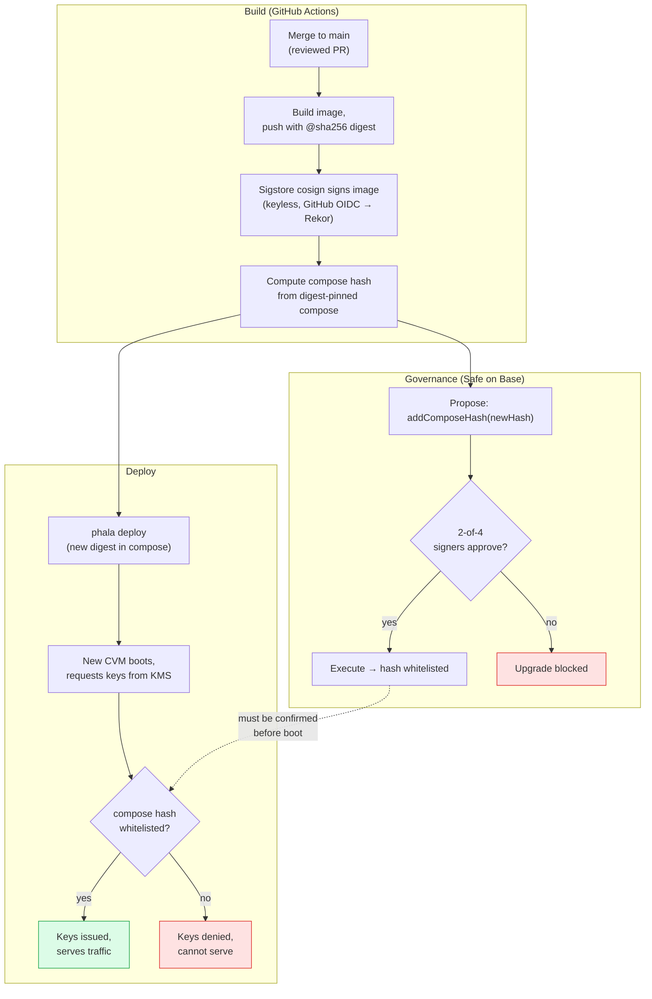

Attestation proves *what code an enclave is running*. This page covers the other
half: *who decides which code is allowed to run*, and how that decision is made in
the open so you can audit it.

The short version: **no Lit employee — and no single party at all — can push code to
the production enclave unilaterally.** Every upgrade requires both an on-chain
governance approval by a multisig and a separate deployment, and neither alone is
enough.

## Two independent actions, by design

Because the [On-Chain KMS](/architecture/verification/onchain-kms) only releases keys
to enclaves whose compose hash is whitelisted, shipping a new version takes **two
actions that cannot be performed by the same step**:

1. **Governance** — the Safe multisig approves an on-chain transaction adding the new
   release's compose hash to the `DstackApp` whitelist.
2. **Deployment** — CI builds and pushes the new image and restarts the CVM.

If you deploy without the whitelist, the new enclave boots but the KMS refuses its
keys, so it cannot serve traffic. If you whitelist without deploying, nothing
changes. Both are public; both are required.

## Who holds the keys

The `DstackApp` contract ([`0x3F91…05FfC`](https://basescan.org/address/0x3F91Deaf16FF7C823eE65081d6bAFA1cEea05FfC))
and the Phala KMS contract are both owned by a **Safe multisig**
([`0xF688…1098`](https://app.safe.global/base:0xF688411c0FFc300cAb33EB1dA651DBb3E6891098))
on Base.

| Property | Value | How to confirm |
|---|---|---|
| **Threshold** | **2 of 4** signers must approve any change | `cast call 0xF688…1098 "getThreshold()(uint256)" --rpc-url https://mainnet.base.org` |
| **Signers** | 4 distinct Lit-controlled keys | `cast call 0xF688…1098 "getOwners()(address[])" --rpc-url https://mainnet.base.org` |
| **Safe version** | 1.4.1 | `cast call 0xF688…1098 "VERSION()(string)" --rpc-url https://mainnet.base.org` |
| **Timelock** | None — the Safe owns the contracts directly | `owner()` on the app returns the Safe address, not a timelock |

A single compromised signer key cannot change the whitelist; it takes a quorum.
There is currently **no timelock delay** on top of the multisig, so an approved
change takes effect as soon as the quorum executes it. (If you require a mandatory
review window before any code can receive keys, that is one reason to self-host — see
below.)

<Note>
These values are live on-chain. Always confirm them yourself with the `cast` commands
above rather than trusting this page — that is the whole point of attestation.
</Note>

## The release flow

Production uses a **two-phase Safe workflow**: a CI step *proposes* the
`addComposeHash` transaction, signers *approve* it in the Safe UI, and it is then
*executed* on-chain. The ordering requirement is strict — the whitelist transaction
must be confirmed **before** the new CVM boots and requests keys, or the KMS rejects
it.

## What signers verify before approving

The multisig is only as strong as what its signers check before they sign. A
compose hash is just 32 bytes; approving it blindly would defeat the model. Before
approving an `addComposeHash` transaction, a signer confirms:

1. **Provenance** — the hash corresponds to an image built by GitHub Actions from a
   reviewed, merged commit on `LIT-Protocol/chipotle`, verifiable via its Sigstore
   cosign signature in the public [Rekor](https://docs.sigstore.dev/) transparency
   log (see [Chain of Trust → Image provenance](/architecture/verification/chain-of-trust#application-layer)).
2. **Reproducibility** — the compose hash can be recomputed locally from the
   digest-pinned `docker-compose` and matches the value in the proposed transaction.
3. **Diff review** — the change between the currently-whitelisted release and the new
   one has been reviewed.

Only after these hold does a signer add their approval. Two independent signers
performing this check is the human gate behind the cryptographic one.

## Rollback

To roll back, redeploy a previous image whose compose hash is **still whitelisted** —
no governance action is required, because old hashes are not removed automatically.
To *forbid* a version (e.g. one found to be vulnerable), the multisig removes its
compose hash from `DstackApp` with `removeComposeHash`, another 2-of-4 action. See
[Incident Response](https://github.com/LIT-Protocol/chipotle/blob/main/architectureDocs/deployment/incident-response.md)
for compromise and emergency-revocation scenarios.

## Self-hosting: govern releases on your own terms

If you self-host Lit Chipotle, **you own the governance, not Lit.** You deploy your
own `DstackApp` contract and point its owner at *your own* Safe (or wallet, timelock,
or DAO). That means:

- **You approve every release.** Lit publishing a new version does not change what
  *your* enclave runs. A new compose hash only takes effect in your deployment when
  *your* signers whitelist it.
- **On your own timeline.** You can pin a reviewed compose hash indefinitely, audit a
  new Lit release at your own pace, and whitelist it only when you are satisfied —
  there is no forced upgrade.
- **With your own controls.** Want a mandatory review delay? Put a timelock in front
  of your Safe. Want a higher quorum or different signers? Configure your own
  threshold. The hosted service runs a 2-of-4 Safe with no timelock; your deployment
  can be as conservative as your compliance posture requires.

This is the deepest form of the "don't trust, verify" model: you are not just
verifying Lit's releases, you are the one *authorizing* them. See
[Self-Hosting](/architecture/self-hosting) for the operational picture.

## What's next

<CardGroup cols={2}>
  <Card title="On-Chain KMS" icon="key" href="/architecture/verification/onchain-kms">
    The contracts that gate key release, and how to confirm the multisig owns them.
  </Card>
  <Card title="What Is Attestation?" icon="lightbulb" href="/architecture/verification/attestation">
    The plain-English foundation: what the enclave proves and why it's trustworthy.
  </Card>
  <Card title="Self-Hosting" icon="server" href="/architecture/self-hosting">
    Run and govern your own deployment, approving releases on your own timeline.
  </Card>
  <Card title="Full Verification Guide" icon="list-checks" href="/architecture/verification/full-verification">
    Walk the on-chain governance Safe and verify every layer yourself.
  </Card>
</CardGroup>
