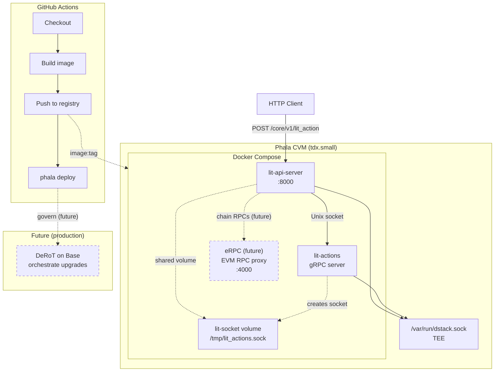

# Deployment

This document describes how to deploy the Lit node stack (`lit-api-server` and `lit-actions`) to Phala Cloud using the smallest available CVM instance.

## Overview

The deployment uses:

- **GitHub Actions** — CI/CD workflow triggered on push to `main` or manual dispatch
- **Docker** — Multi-stage build producing both binaries in a single image
- **Docker Compose** — Two services sharing a Unix socket for gRPC communication
- **Phala Cloud** — Confidential Virtual Machine (CVM) with TEE, instance type `tdx.small`

## Architecture



## Files

| File | Purpose |
|------|---------|
| `.github/workflows/deploy-phala.yml` | GitHub Actions workflow |
| `Dockerfile.phala` | Multi-stage build for both binaries |
| `docker-compose.phala.yml` | Service definitions and shared socket volume |
| `.dockerignore` | Excludes build artifacts from Docker context |

## Build

The `Dockerfile.phala` produces a single image containing:

- `lit_actions` — Lit Actions gRPC server (Deno-based JS runtime)
- `lit-api-server` — Rocket HTTP API server (built with `phala` feature for attestation)

Both run as separate containers in the same CVM, communicating via a shared Unix socket at `/tmp/lit_actions.sock`.

### Phala attestation

When built with the `phala` feature, `lit-api-server` exposes `GET /phala/v1/verify`, which returns a TDX attestation quote from the dstack socket. Callers can verify the CVM is running in genuine Intel TDX hardware.

## Required Secrets

Configure these in **Settings → Secrets and variables → Actions**:

| Secret | Description |
|--------|-------------|
| `PHALA_CLOUD_API_KEY` | From [Phala Cloud Dashboard](https://cloud.phala.network/dashboard) → Avatar → API Tokens |
| `DOCKER_REGISTRY_USERNAME` | Docker Hub or GHCR username |
| `DOCKER_REGISTRY_PASSWORD` | Docker Hub access token or GHCR PAT |
| `DOCKER_IMAGE` | Full image path, e.g. `docker.io/username/lit-node-express` or `ghcr.io/owner/lit-node-express` |
| `PHALA_APP_NAME` | CVM name, e.g. `lit-api-server` |

## Workflow Steps

1. **Checkout** — Clone the repository
2. **Log in to registry** — Authenticate with Docker Hub or GHCR
3. **Build and push** — Build the image and push with tags `$SHA` and `latest`
4. **Prepare compose** — Substitute `${DOCKER_IMAGE}` with the built image tag
5. **Deploy** — Run `phala deploy` with `--instance-type tdx.small`

## Manual Deployment

To deploy locally (after `phala login`):

```bash
# Build the image
docker build -f Dockerfile.phala -t lit-node-express .

# Set the image for compose
export DOCKER_IMAGE=lit-node-express:latest

# Deploy to Phala
phala deploy -c docker-compose.phala.yml -n lit-api-server --instance-type tdx.small
```

## Instance Type

The workflow uses `tdx.small`, the smallest available Phala CVM plan. For custom sizing:

```bash
phala deploy --vcpu 1 --memory 2048MB --disk-size 40GB ...
```

## Current Limitations

- **No autoscaling** — Phala CVM autoscaling is not currently configured; the deployment runs a fixed instance.
- **No chain RPCs** — Chain RPC endpoints are not provided for this deployment; configure external RPCs as needed.

## Future Integrations (Tentative)

**[eRPC](https://github.com/erpc/erpc)** — fault-tolerant EVM RPC proxy and re-org aware caching solution. A future, optional third-party service that could be added as a Docker Compose service to provide chain RPC endpoints for this deployment. eRPC offers retries, circuit breakers, failovers, rate limiting, and a unified dashboard. Integration is not planned or implemented; this is a placeholder for potential future work.

## Orchestration: Development vs Released

| Environment | Orchestration |
|-------------|---------------|
| **Development** | Simulator — local TEE simulator for development. |
| **Released** | Either Phala Cloud or [DeRoT](https://docs.phala.com/dstack/design-documents/decentralized-root-of-trust) on Base, selected via Cargo feature flags: `pcloud` (Phala Cloud) or `derot` (on-chain governance on Base). |
