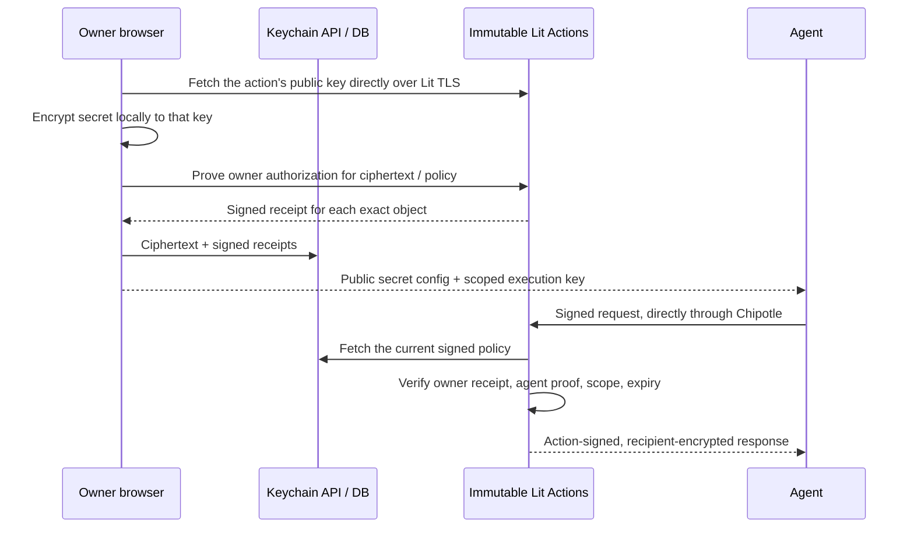

**Lit Agent Keychain** is a vault for the credentials your AI agents use. You encrypt each secret in your browser, then approve specific agent public keys to use it. Agents fetch secrets through Lit Protocol's network of hardware enclaves, which check your signed approval on every request. It works through an SDK, a CLI, or any MCP client such as Claude Code, Codex or Cursor.

The hosted app is at [keychain.litprotocol.com](https://keychain.litprotocol.com).

<CardGroup cols={2}>
  <Card title="Quickstart" icon="rocket" href="/keychain/quickstart">
    Store a secret, approve an agent, and read it from code, the CLI or an MCP client in about five minutes.
  </Card>
  <Card title="SDK, CLI and MCP" icon="terminal" href="/keychain/agents">
    Everything the agent side needs: commands, MCP tools, the three credential files, and what each refusal means.
  </Card>
  <Card title="Connected services" icon="plug" href="/keychain/connected-services">
    Stripe, OpenAI, GitHub, Slack and Supabase actions that use a key inside the enclave without ever returning it.
  </Card>
  <Card title="Security model" icon="shield-check" href="/keychain/security">
    What the cryptography enforces, what the operator can and cannot do, and how the endpoint is attested.
  </Card>
</CardGroup>

<Tip>
**Setting this up with an AI agent?** Hand it
[`https://keychain.litprotocol.com/SKILL.md`](https://keychain.litprotocol.com/SKILL.md),
a machine-readable playbook that walks any coding agent through generating an identity,
getting approved, and reading secrets at runtime.
</Tip>

## How it works

Encrypt once. Approve per agent. Lit checks every request.

<Steps>
  <Step title="Your browser encrypts the secret">
    Every secret gets its own immutable Lit Action with its own key, derived inside a hardware enclave. Your browser fetches that action's public key straight from Lit and encrypts locally. Only ciphertext reaches the Keychain database.
  </Step>
  <Step title="You authorize an agent's public key">
    The agent generates its own Ed25519 identity and gives you only the public half. You approve it for a secret with an expiry of up to 90 days. Your wallet, passkey or Google-verified session signs the approval, and Lit issues a receipt that Keychain cannot forge.
  </Step>
  <Step title="The agent asks Lit, not Keychain">
    The agent signs a request and sends it directly to the Lit action. The action verifies your receipt, the agent's key, scope and expiry, then returns the result encrypted to that agent only. Revoke any time from the dashboard.
  </Step>
</Steps>

## Two kinds of secrets

| | Stored secret | Connected service |
|---|---|---|
| What the agent gets | The plaintext, re-encrypted to the agent's key and decrypted on its own machine | A bounded result from one fixed API call. The credential is never returned |
| Works for | Anything: API keys, tokens, passwords, PEM keys | Stripe balance, OpenAI chat, GitHub file reads, Slack messages, Supabase table reads and inserts |
| Agent call | `keychain.get(name)`, `keychain run -- <command>`, or the `get_secret` MCP tool | `keychain.use(name, input)`, `keychain use`, or one MCP tool per action |
| Exportable by the owner | Yes | No. Keep your original copy elsewhere |

A **stored secret** is for anything an agent needs to hold itself. A **connected service** never hands the credential to the agent: the action decrypts it inside the enclave, makes one fixed upstream call, and returns only the documented fields. Each integration is a reviewed action from the open [agent-keychain-library](https://github.com/LIT-Protocol/agent-keychain-library) catalog whose manifest pins the hosts it may reach and the shape of what it returns. See [Connected services](/keychain/connected-services).

## What the agent holds

Exactly two files, both JSON and self-describing:

- **Agent identity**: an Ed25519 key pair the agent generates locally with `keychain init`. Only the public key is ever shared.
- **Agent config** (`NAME.keychain.json`): downloaded from Keychain after you approve the agent. It lists the approved secrets and includes a scoped execution key that pays for Lit execution. That key is a billing credential; it cannot read a secret without the agent's private key and your signed approval.

If an agent's machine is compromised, the attacker can read the secrets that agent was approved for until you revoke it, exactly as with any credential on a compromised host. Revoke from the dashboard, replace the execution key, and prefer connected services for keys that should never be returned to an agent.

## Pricing

| Plan | Storage | Included |
|---|---|---|
| Free | 5 secrets | Every sign-in method, agent access, rotation, recovery and execution under fair use. No card required. |
| Standard, $10/month | 1,000 secrets | Same model. Rotations use the same slot. No automatic overage charges. |
| Custom | More | Contact support from the app for higher storage or high-volume usage. |

Cancelling never deletes your secrets or encrypted backups, and it is not revocation: enrolled actions keep working on Free. If a paid plan expires while you hold more than five secrets, storage mutations stop, but login, revocation and backups remain. Third-party provider charges (OpenAI, Slack plans, Supabase) are separate.

## Built on Lit primitives

The Keychain is a production example of two Chipotle patterns: [Derived Actions](/lit-actions/derived-actions) (one audited template plus a canonical manifest gives every secret its own immutable action and key) and [Signed Data in Untrusted Storage](/lit-actions/signed-storage) (owner receipts over canonical JSON that the operator can withhold but not forge). The client, API, SDK and every action are Apache-2.0 in the [chipotle repository](https://github.com/LIT-Protocol/chipotle/tree/main/lit-agent-keychain).
