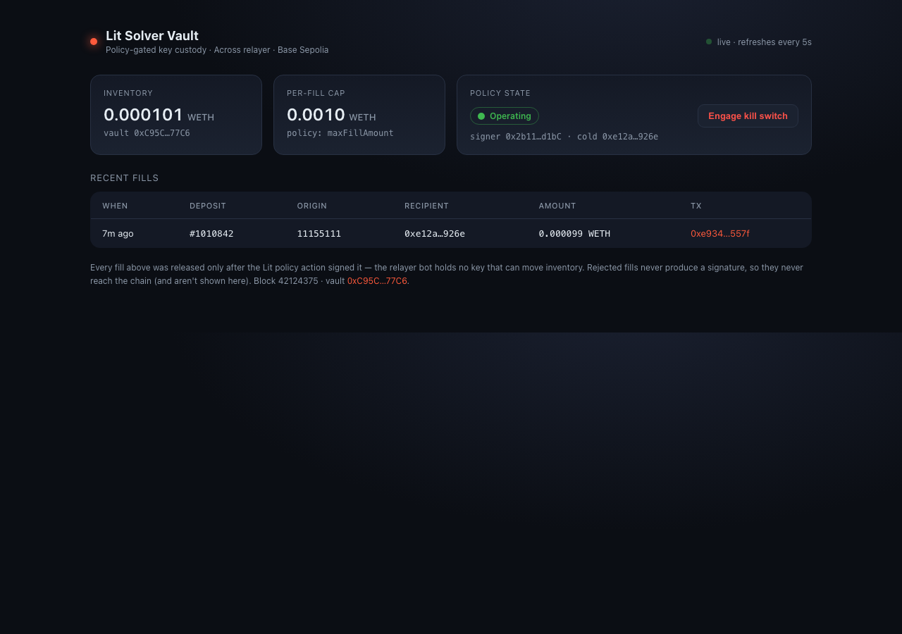

# Lit Solver Vault — Dashboard



A small read-only ops view for an `AcrossSolverVault`, meant as sales collateral
(clean screenshot / Loom frame) more than production tooling. It shows:

- **Inventory** — the vault's WETH balance.
- **Per-fill cap** — the policy's `maxFillAmount`.
- **Policy state** — operating vs. kill-switch-engaged, with a one-click toggle.
- **Recent fills** — `AcrossFillExecuted` events: deposit id, origin chain,
  recipient, amount, and a Basescan link.

The vault reads happen server-side (Next.js API routes), so the RPC URL and the
owner key never reach the browser. The kill-switch toggle posts to a server
route that signs with the owner key.

> **Security:** the kill-switch route has **no authentication**. It is disabled
> by default and only works when `DASHBOARD_ENABLE_WRITES=true`. Set that ONLY
> when the dashboard is on localhost or a trusted network — anyone who can reach
> the route can flip the kill switch with the owner key. Put real auth in front
> before exposing it. With writes off (the default), the dashboard is fully
> read-only and the toggle shows "Read-only".

## Run

From `examples/lit-solver-vault/dashboard`:

```bash
npm install
cp .env.local.example .env.local
# fill in:
#   ALCHEMY_BASE_SEPOLIA_URL  (same as the example's .env)
#   VAULT_ADDRESS             (copy ACROSS_VAULT_ADDRESS from ../.env)
#   OWNER_PRIVATE_KEY         (optional — only for the kill-switch toggle)
npm run dev
# open http://localhost:3030
```

It polls `/api/state` every 5 seconds, so a fill landed via
`npm run across:fill` (in the parent example) shows up within a few seconds —
nice for a live demo.

## Notes

- Targets the **Across** vault (`AcrossSolverVault` + `AcrossFillExecuted`). To
  point it at the mock `SolverVault` instead, swap the event/ABI in
  `lib/vault.js` (`FillExecuted`, `allowedSettlement`).
- Rejected fills (policy denials) happen off-chain inside the Lit Action and
  produce no signature, so there's nothing on-chain for the dashboard to show —
  the fills table is the on-chain truth. A production build would also stream
  the action's decision log from wherever you persist it.
