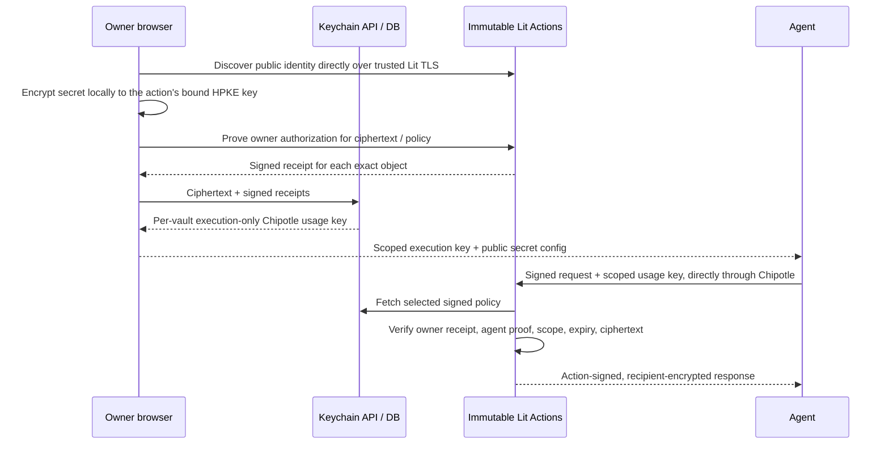

# Lit Agent Keychain v2

A React client, Rust API and immutable Lit Actions for owner-authorized agent access
to credentials. Secrets are encrypted locally; PostgreSQL stores ciphertext and
owner-authorized policy records. Wallet, passkey and Google-only sign-in are alternatives.
Google users need neither a wallet nor a passkey.



The operator is trusted to serve the latest signed policy. It can replay old valid
permissions, including undoing a revocation, but cannot forge owner authorization.
The requester still needs an authorized agent key. See [SECURITY.md](SECURITY.md).

## Features

- RainbowKit/wagmi EOA wallet connection, native WebAuthn P-256 passkeys, Google JWT
  verification inside Lit with a nonce-bound, locally held session key.
- One immutable encryption action per secret; an immutable owner authorization action
  produces durable receipts without retaining Google tokens in the database.
- X25519/HKDF-SHA256/AES-256-GCM HPKE key wrapping and response encryption; local
  AES-256-GCM payload encryption. Action signatures authenticate results as well as keys.
- Explicit agent public-key enrollment, exact ciphertext/version scopes, disable/revoke,
  owner-approved renewal, atomic rotation, and credential replacement/recovery.
- New secrets grant no agent access. Permissions default to 30 days, with a 90-day maximum.
  Owner credential membership is independent and normally lasts until revoked.
- "Use inside Lit" action catalog from the public
  [agent-keychain-library](https://github.com/LIT-Protocol/agent-keychain-library)
  repo, pinned to a commit in `package.json`: Stripe balance, OpenAI chat, GitHub
  file reads, Slack messages, Supabase table reads and inserts under an
  owner-written allowlist. Each action's manifest pins the hosts it may reach
  (exact, or one label under a `*.` provider domain such as `*.supabase.co`),
  the credential shape, agent input and result shapes; the harness in
  `actions/secret-common.ts` enforces them in the enclave. No credential-export,
  arbitrary URL, code, redirect, or migration path. Contributors add actions by PR
  to that repo; Keychain picks them up with `npm run library:pin <sha>`.
- Encrypted backups of current versions and policies; restore never overwrites another secret.
- Free for 5 stored secrets, $10/month for 1,000; rotations use the same slot. Contact us for more.
- Stripe Checkout and customer portal, period-end cancellation, retained encrypted backups.
- Transactional mutation audit, paginated secrets/activity, scoped user execution keys.
- Agent SDK, CLI and a local stdio MCP server (`npx @lit-protocol/keychain mcp`);
  agent keys are generated locally. `keychain run -- <command>` hands secrets to a
  child process as environment variables or short-lived mode-0600 files without
  printing them. No management bearer tokens, operator grant
  signer, PKP vault provisioning, chain registry, relayer, or paymaster.
- Client-side remote attestation before execution requests to configured/pinned production Lit origins (unknown origins are not automatically attested): TDX quote
  chain to a pinned Intel root, event-log replay, measured app/compose identity,
  on-chain governance whitelist, and (Node) TLS certificate binding.

## Owner setup and recovery

For agent installation and the separate stored-secret (`get`/`run`) and connected-service
(`use`) paths, see [SDK quickstarts](sdk/README.md). For provider credentials and
exact inputs, see [provider recipes](PROVIDERS.md). An **export action** releases a
raw secret to an approved agent; **Agent config** downloads public locators plus a
billing key; **encrypted backup export** saves ciphertext/policies. These are not
interchangeable operations.

### Prepare recovery while you still have access

1. Sign in at your existing Keychain origin. Open **Recovery & backups** and approve
   an additional owner credential you control. Test it before retiring the first.
2. Download an encrypted backup and store it privately off-device. Download a fresh
   copy after every credential change and secret rotation. Backups contain current
   ciphertext/policies, not private keys or historical secret versions.
3. Retain the original provider credentials independently for connected services.
   Strict-mode actions cannot export or migrate them; an action upgrade or loss of
   Lit's derivation root cannot be repaired with ciphertext alone.

### Restore walkthrough and credential-loss decisions

- **New device, approved credential available:** choose **Recover an existing vault**
  on the sign-in page, select your encrypted backup, then sign with an owner
  credential approved for that vault. Use the original deployment/origin for
  passkeys; a newly created passkey is not the old credential. Confirm the restored
  secret list and permissions, and download fresh agent configs where necessary.
- **Google-only owner:** sign in with the same Google account, not simply the same
  email spelling on a different account. If inaccessible, use Google's recovery
  or a previously approved alternate owner; Keychain cannot reset Google identity.
- **Missing vault:** restore can initialize credential settings from the signed
  backup. **Existing vault:** restore cannot overwrite its credential settings or a
  different existing secret. On a conflict, stop and compare the vault/secret and
  backup versions; do not delete current data to force an old restore.
- **Backup lost, credential available:** sign in and make a new backup if the
  service still has the vault. A credential alone does not recreate lost ciphertext.
- **All approved credentials lost:** a backup alone is insufficient. Recover through
  the credential provider (for example a synced passkey or Google recovery) or use
  a previously approved alternate credential. There is no operator reset token.
- **Agent key lost:** generate a new identity on a trusted machine, approve its
  public key per secret, revoke the old key and distribute new configs. The backup
  does not recover the agent's private key.

These steps describe supported behavior, not evidence of a successful live Google,
physical-passkey or provider recovery test. See [security limits](SECURITY.md).

### Rotations and revocation

| Change                                 | Owner steps                                                                                                 | Agent/config consequence                                                                                                 |
| -------------------------------------- | ----------------------------------------------------------------------------------------------------------- | ------------------------------------------------------------------------------------------------------------------------ |
| Secret value (without approval update) | Issue a replacement at the provider; rotate the secret; reapprove intended agents for the new exact version | Old version grants alone do not cover the new version                                                                    |
| Rotate & approve                       | Use the combined dashboard action to rotate and move existing agents to the new version                     | No separate reapproval is needed; existing downloaded configs can resolve the new version immediately                    |
| Execution/billing key                  | Replace execution key in the owner dashboard                                                                | Update every agent config or `CHIPOTLE_USAGE_API_KEY` override, then restart MCP; identity/secret approvals are separate |
| Agent signing key                      | Generate a new identity, approve new public key, revoke old grants                                          | Never overwrite a working identity without a recovery plan; distribute new identity/config privately                     |
| Immutable action release               | Keep old release available; reimport original credential into the new action and approve explicitly         | A config edit cannot migrate ciphertext; strict-mode backup cannot supply plaintext                                      |
| Owner credential                       | Approve/test replacement before revoking old credential                                                     | Download a fresh encrypted backup; existing metadata sessions are invalidated                                            |

For suspected exposure, revoke at the upstream provider too. With honest storage,
revocation applies to subsequent policy lookups; in-flight calls may finish and
plaintext already received cannot be recalled. The operator can replay older
still-valid permissions, as documented in SECURITY.md. **Cancellation is not
revocation.** Slack posts and Supabase inserts are not exactly-once: inspect provider
state after uncertain completion; do not blindly retry writes.

### Storage entitlements and charges

| State                             | Storage                                    | Execution and recovery                                                     |
| --------------------------------- | ------------------------------------------ | -------------------------------------------------------------------------- |
| Free                              | Up to 5 secrets                            | Sponsored enrolled actions under fair use; backups/revocation available    |
| Standard                          | $10/month, up to 1,000 secrets             | Same authorization model; rotations use no additional slot                 |
| Cancelled, still in paid period   | Paid entitlement until period end          | Cancellation does not revoke agent grants                                  |
| Paid expired, at/below Free limit | Free entitlement                           | Sponsored execution continues on Free                                      |
| Paid expired, above Free limit    | Storage mutations blocked while over limit | Login, revocation and encrypted backups remain; no automatic data deletion |

There is no hard per-user execution or dollar cap and no automatic Keychain overage
charge. A numerical fair-use quota is not specified here; contact Support via the
app before high-volume usage or for custom storage limits. Report outages with
operation/time and a sanitized error, never keys/configs. Provider API charges
(OpenAI, Slack plan requirements, Supabase, etc.) are separate from the Keychain
subscription. Check the owner billing page and refresh billing state after checkout;
do not infer successful payment from a browser redirect alone.

## Local development

Use Rust 1.91, Node 22, npm and PostgreSQL 17. This directory has its own Cargo package
and npm lockfile. It is not part of a root Cargo workspace.

```sh
cd lit-agent-keychain
npm ci
npm run build
cp .env.example .env
# Set the values in .env, then export them in your shell.
cargo +1.91 run
```

The app does not automatically load `.env`. `DATABASE_URL`, `PUBLIC_BASE_URL`, and
the Chipotle and Stripe settings in `.env.example` are required. Use a dedicated database. `PUBLIC_BASE_URL` must be
an origin, normally HTTPS; HTTP is supported only on loopback for development.
Use `localhost` rather than a numeric loopback address for browser passkeys.
The service serves `web/dist` and applies migrations on startup.

`CHIPOTLE_MASTER_API_KEY` belongs to a dedicated managed Chipotle account. The API
creates two groups per vault and an execution-only usage key. The browser/agent gets
that key; it can execute only the immutable owner action, fixed public-key helper,
and the vault's enrolled secret actions on every plan. It cannot manage the
account or authorize access to a secret without the corresponding owner/agent proof.
The API encrypts usage keys at rest with `USAGE_KEY_ENCRYPTION_KEY` and vault-bound AAD.
Owners can replace an execution key; distribute the replacement to their agents.

`LIT_EXECUTION_KEY` is a separate server-only execution key with `executeInGroups=[0]`,
used for login bootstrap and server receipt verification. The three execution-limit
environment settings cap server-sponsored login attempts, including failures. User
keys execute directly on Chipotle, share the parent balance, and have **no hard
per-user dollar or execution cap**. This is the accepted launch limitation. Fair use
is included on Free and Standard alike; there are no automatic user overage charges.
See [BILLING.md](BILLING.md) for Stripe setup and the custom-plan operator command.

Google-only sign-in requires `GOOGLE_CLIENT_ID` and the frontend origin registered
on that Google OAuth client. Its callback uses Google Identity Services' nonce
parameter. Google session keys and ID tokens remain in browser memory and expire.
`VITE_WALLETCONNECT_PROJECT_ID` enables WalletConnect options at build time; injected
wallets work without it. ERC-1271/6492 contract wallets are not supported in this release.

`VITE_LIT_API_URL` is the client trust anchor, compiled at build time. It defaults to
`https://api.chipotle.litprotocol.com`. Do not obtain a replacement endpoint from an
untrusted API response. Public identity discovery runs the fixed `actions/public-key.js` helper through
Chipotle's existing `POST /core/v1/lit_action`. The secret action's `publicKey` operation
then signs its encryption-key binding. No new REST endpoint is needed. Bootstrap
trusts that Lit origin's TLS;
it does not claim quote-based public-key attestation.

For hot reload, `npm run dev` starts Vite on port 5173 and proxies API calls to 8000.
Set `PUBLIC_BASE_URL=http://localhost:5173` for that development deployment. The action's
pinned registry origin must be reachable from the Lit runtime; use the test adapter
for a fully local environment, or a public HTTPS development deployment for live Lit.

## Build and deploy

```sh
# Repository root context includes the pinned Rust IPFS dependency fix.
docker build -f lit-agent-keychain/Dockerfile -t lit-agent-keychain .
```

Set build args `VITE_LIT_API_URL` and optionally `VITE_WALLETCONNECT_PROJECT_ID`.
The image runs as an unprivileged user. For Railway, use repository root as the build
context and `lit-agent-keychain/railway.json` as the config path; the Dockerfile path
is relative to the repository root.

Publish the agent SDK with `./publish.sh`. It builds, compares the packed contents
with what npm serves for the current version, bumps the patch version only when
they differ (`--bump minor|major` to choose), commits and tags
`keychain-sdk-v<version>`, then publishes. `--dry-run` shows the decision without
committing or publishing. A local `before=` cooldown in `~/.npmrc` does not affect
it; the published tarball is fetched directly and integrity-checked.

This is a prelaunch, incompatible replacement. Migration `20260911000001` drops the
legacy Keychain tables and their contents. Stop the old service before applying it.
It does not delete upstream PKPs/usage keys from the old Lit account; retire those
separately if that account will remain in use. No production deployment or DB reset is part of this PR.
Live compatibility validation uses temporary Chipotle groups/keys and removes them.

Deploy the private-key telemetry fix and billing-owner guards in `lit-api-server`
and `lit-payments` before distributing user execution keys. No direct Phala access
is required for Keychain.
Retain reproducible client/SDK artifacts, `generated/release.json`, and lockfiles for
each deployed release. Changing action bytes changes encryption keys.
`actions/catalog.lock.json` pins the SHA-256 of every built template (authority and
each catalog action); `npm run build:actions` fails on drift, so a rebuild against
different sources or dependencies is an explicit `--update-lock` release, never a
silent change. Every released version is retained in `actions/archive/` and served
by content hash from `/api/templates/<sha256>`, so vaults and secrets created under
an earlier release keep working (see "Authority releases" in SECURITY.md). Introduce
a new action id instead of changing a deployed one; "use inside Lit" secrets require
reimporting the original credential to move to a new action. An encrypted DB backup alone cannot recover
from loss of Lit's key derivation root or an incompatible network derivation change.

## Verification

```sh
npm run build
npm test
cargo +1.91 fmt --check
cargo +1.91 clippy --all-targets -- -D warnings
cargo +1.91 test
npm run test:runtime
```

`test:runtime` compiles Lit's actual Deno worker, executes the complete encryption
release action with a local HTTP policy fixture and synthetic action keys, verifies
the returned signature/HPKE plaintext, and scans tracing for key/plaintext leakage.
It makes no live TEE attestation claim. The suite also includes RFC9180 vectors,
JavaScript/Rust receipt and multichunk CID vectors, and adversarial proof tests.

Run full local API/browser tests with a dedicated local database (its name must
contain `test` or end in `_ci`):

```sh
npx playwright install chromium
KEYCHAIN_TEST_DATABASE_URL=postgres://localhost/keychain_test node scripts/test-local.mjs
```

This script builds the app, starts local services on ports 55440/55441/55442, applies the
replacement migrations to that test database, runs SDK/API/browser/storage tests, and
stops its services. The Keychain CI workflow runs the same suite. Its Lit adapter executes the bundled code while substituting only platform
key derivation, external Google issuance, and Stripe billing. It never calls production services.

Agent examples: [sdk/README.md](sdk/README.md). Security/operational limits:
[SECURITY.md](SECURITY.md). Review findings: [ADVERSARIAL_REVIEW.md](ADVERSARIAL_REVIEW.md).
