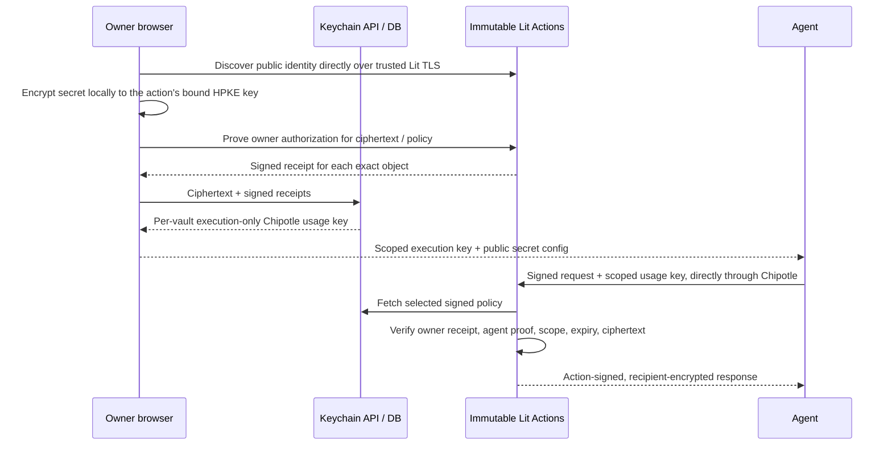

# Lit Agent Keychain v2

A React client, Rust API and immutable Lit Actions for owner-authorized agent access
to credentials. Secrets are encrypted locally; PostgreSQL stores ciphertext and
owner-authorized policy records. Wallet, passkey and Google-only sign-in are alternatives.
Google users need neither a wallet nor a passkey.



The operator is trusted to serve the latest signed policy. It can replay old valid
permissions, including undoing a revocation, but cannot forge owner authorization.
The requester still needs an authorized agent key. See [SECURITY.md](SECURITY.md).

## Features

- RainbowKit/wagmi EOA wallet connection, native WebAuthn P-256 passkeys, Google JWT
  verification inside Lit with a nonce-bound, locally held session key.
- One immutable encryption action per secret; an immutable owner authorization action
  produces durable receipts without retaining Google tokens in the database.
- X25519/HKDF-SHA256/AES-256-GCM HPKE key wrapping and response encryption; local
  AES-256-GCM payload encryption. Action signatures authenticate results as well as keys.
- Explicit agent public-key enrollment, exact ciphertext/version scopes, disable/revoke,
  owner-approved renewal, atomic rotation, and credential replacement/recovery.
- New secrets grant no agent access. Permissions default to 30 days, with a 90-day maximum.
  Owner credential membership is independent and normally lasts until revoked.
- Strict Stripe balance integration: fixed HTTPS request and bounded numeric projection;
  no credential-export, arbitrary URL, code, redirect, or migration path.
- Encrypted backups of current versions and policies; restore never overwrites another secret.
- $10/month for 1,000 stored secrets; rotations use the same slot. Contact us for more.
- Stripe Checkout and customer portal, period-end cancellation, retained encrypted backups.
- Transactional mutation audit, paginated secrets/activity, scoped user execution keys.
- Agent SDK, CLI and a local stdio MCP server (`npx @lit-protocol/keychain mcp`);
  agent keys are generated locally. No management bearer tokens, operator grant
  signer, PKP vault provisioning, chain registry, relayer, or paymaster.
- Client-side remote attestation of the Lit endpoint before any request: TDX quote
  chain to a pinned Intel root, event-log replay, measured app/compose identity,
  on-chain governance whitelist, and (Node) TLS certificate binding.

## Local development

Use Rust 1.91, Node 22, npm and PostgreSQL 17. This directory has its own Cargo package
and npm lockfile. It is not part of a root Cargo workspace.

```sh
cd lit-agent-keychain
npm ci
npm run build
cp .env.example .env
# Set the values in .env, then export them in your shell.
cargo +1.91 run
```

The app does not automatically load `.env`. `DATABASE_URL`, `PUBLIC_BASE_URL`, and
the Chipotle and Stripe settings in `.env.example` are required. Use a dedicated database. `PUBLIC_BASE_URL` must be
an origin, normally HTTPS; HTTP is supported only on loopback for development.
Use `localhost` rather than a numeric loopback address for browser passkeys.
The service serves `web/dist` and applies migrations on startup.

`CHIPOTLE_MASTER_API_KEY` belongs to a dedicated managed Chipotle account. The API
creates two groups per vault and an execution-only usage key. The browser/agent gets
that key; it can execute only the immutable owner action, fixed public-key helper,
and (while subscribed) the vault's enrolled secret actions. It cannot manage the
account or authorize access to a secret without the corresponding owner/agent proof.
The API encrypts usage keys at rest with `USAGE_KEY_ENCRYPTION_KEY` and vault-bound AAD.
Owners can replace an execution key; distribute the replacement to their agents.

`LIT_EXECUTION_KEY` is a separate server-only execution key with `executeInGroups=[0]`,
used for login bootstrap and server receipt verification. The three execution-limit
environment settings cap server-sponsored login attempts, including failures. User
keys execute directly on Chipotle, share the parent balance, and have **no hard
per-user dollar or execution cap**. This is the accepted launch limitation. Fair use
is included in the subscription; there are no automatic user overage charges.
See [BILLING.md](BILLING.md) for Stripe setup and the custom-plan operator command.

Google-only sign-in requires `GOOGLE_CLIENT_ID` and the frontend origin registered
on that Google OAuth client. Its callback uses Google Identity Services' nonce
parameter. Google session keys and ID tokens remain in browser memory and expire.
`VITE_WALLETCONNECT_PROJECT_ID` enables WalletConnect options at build time; injected
wallets work without it. ERC-1271/6492 contract wallets are not supported in this release.

`VITE_LIT_API_URL` is the client trust anchor, compiled at build time. It defaults to
`https://api.chipotle.litprotocol.com`. Do not obtain a replacement endpoint from an
untrusted API response. Public identity discovery runs the fixed `actions/public-key.js` helper through
Chipotle's existing `POST /core/v1/lit_action`. The secret action's `publicKey` operation
then signs its encryption-key binding. No new REST endpoint is needed. Bootstrap
trusts that Lit origin's TLS;
it does not claim quote-based public-key attestation.

For hot reload, `npm run dev` starts Vite on port 5173 and proxies API calls to 8000.
Set `PUBLIC_BASE_URL=http://localhost:5173` for that development deployment. The action's
pinned registry origin must be reachable from the Lit runtime; use the test adapter
for a fully local environment, or a public HTTPS development deployment for live Lit.

## Build and deploy

```sh
# Repository root context includes the pinned Rust IPFS dependency fix.
docker build -f lit-agent-keychain/Dockerfile -t lit-agent-keychain .
```

Set build args `VITE_LIT_API_URL` and optionally `VITE_WALLETCONNECT_PROJECT_ID`.
The image runs as an unprivileged user. For Railway, use repository root as the build
context and `lit-agent-keychain/railway.json` as the config path; the Dockerfile path
is relative to the repository root.

This is a prelaunch, incompatible replacement. Migration `20260911000001` drops the
legacy Keychain tables and their contents. Stop the old service before applying it.
It does not delete upstream PKPs/usage keys from the old Lit account; retire those
separately if that account will remain in use. No production deployment or DB reset is part of this PR.
Live compatibility validation uses temporary Chipotle groups/keys and removes them.

Deploy the private-key telemetry fix and billing-owner guards in `lit-api-server`
and `lit-payments` before distributing user execution keys. No direct Phala access
is required for Keychain.
Retain reproducible client/SDK artifacts, `generated/release.json`, and lockfiles for
each deployed release. Changing action bytes changes encryption keys. Never silently
rebuild a deployed v2 action against different dependencies; introduce a new action
release and an explicit owner-approved transition. Strict Stripe-only secrets require
reimporting the original credential. An encrypted DB backup alone cannot recover
from loss of Lit's key derivation root or an incompatible network derivation change.

## Verification

```sh
npm run build
npm test
cargo +1.91 fmt --check
cargo +1.91 clippy --all-targets -- -D warnings
cargo +1.91 test
npm run test:runtime
```

`test:runtime` compiles Lit's actual Deno worker, executes the complete encryption
release action with a local HTTP policy fixture and synthetic action keys, verifies
the returned signature/HPKE plaintext, and scans tracing for key/plaintext leakage.
It makes no live TEE attestation claim. The suite also includes RFC9180 vectors,
JavaScript/Rust receipt and multichunk CID vectors, and adversarial proof tests.

Run full local API/browser tests with a dedicated local database (its name must
contain `test` or end in `_ci`):

```sh
npx playwright install chromium
KEYCHAIN_TEST_DATABASE_URL=postgres://localhost/keychain_test node scripts/test-local.mjs
```

This script builds the app, starts local services on ports 55440/55441/55442, applies the
replacement migrations to that test database, runs SDK/API/browser/storage tests, and
stops its services. The Keychain CI workflow runs the same suite. Its Lit adapter executes the bundled code while substituting only platform
key derivation, external Google issuance, and Stripe billing. It never calls production services.

Agent examples: [sdk/README.md](sdk/README.md). Security/operational limits:
[SECURITY.md](SECURITY.md). Review findings: [ADVERSARIAL_REVIEW.md](ADVERSARIAL_REVIEW.md).
