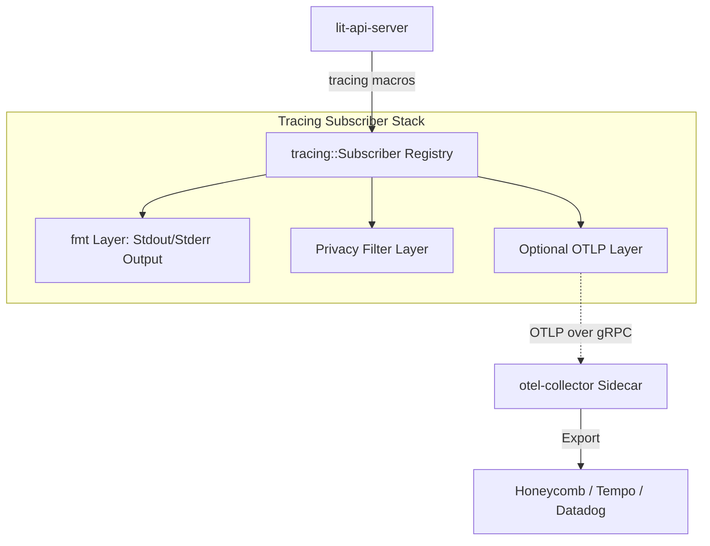

# lit-observability

A lightweight observability crate that integrates standard Rust `tracing` with optional OpenTelemetry (OTLP) exporting.

## Concept

The primary observability mechanism for this stack is the **`tracing`** crate. All application events, spans, and logs are authored using standard `tracing` macros (`info!`, `span!`, etc.).

### 1. Primary Layer (Always On)
By default, the `lit-api-server` and other consumers initialize a `tracing-subscriber` that outputs data to **stdout/stderr**. This ensures observability is always available for local development and standard container logging without any external dependencies.

### 2. OTLP Add-on (Feature Gated)
The OpenTelemetry integration is an optional **Layer** provided by this crate. It is intended to be used in production environments where a stock `otel-collector` runs as a sidecar. 

When enabled via the `otlp` cargo feature (intended for production builds), this crate provides a standard OTLP/gRPC exporter that sends spans and metrics to the collector on `localhost:4317`.

## Architecture Diagram



## Configuration

If the `otlp` layer is used, the endpoint can be configured via `LIT_CONFIG_TELEMETRY_ENDPOINT` (defaults to `http://127.0.0.1:4317`).

## Usage

```rust
// Basic initialization
let (subscriber, _guards) = lit_observability::init_subscriber(cfg);
tracing::subscriber::set_global_default(subscriber).expect("Set subscriber failed");
```
