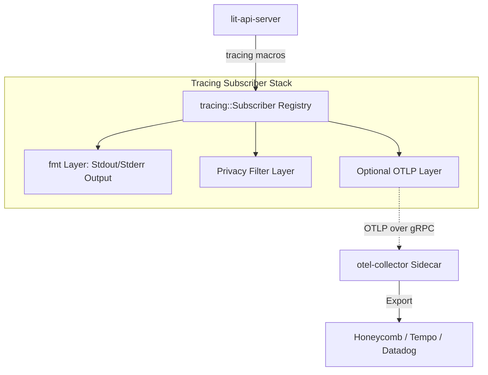

# lit-observability

A lightweight observability crate that integrates standard Rust `tracing` with optional OpenTelemetry (OTLP) exporting.

## Concept

The primary observability mechanism for this stack is the **`tracing`** crate. All application events, spans, and logs are authored using standard `tracing` macros (`info!`, `span!`, etc.).

### 1. Primary Layer (Always On)
By default, the `lit-api-server` and other consumers initialize a `tracing-subscriber` that outputs data to **stdout/stderr**. This ensures observability is always available for local development and standard container logging without any external dependencies.

### 2. OTLP Add-on (Feature Gated)
The OpenTelemetry integration is an optional **Layer** provided by this crate. It is intended to be used in production environments where a stock `otel-collector` runs as a sidecar. 

When enabled via the `otlp` cargo feature (intended for production builds), this crate provides a standard OTLP/gRPC exporter that sends spans and metrics to the collector on `localhost:4317`.

## Architecture Diagram



## Configuration

`init_subscriber` and `create_providers` accept plain strings — callers supply the log level and
collector endpoint directly. There is no LitConfig dependency in this crate.

**lit-api-server** reads these from `NodeConfig.toml` under `[observability]`, with env var
overrides (`RUST_LOG`, `LIT_TELEMETRY_ENDPOINT`) taking precedence:

```toml
[observability]
log_level = "info"
telemetry_endpoint = "http://otel-collector:4317"
```

**lit-actions** reads the same env vars (`RUST_LOG`, `LIT_TELEMETRY_ENDPOINT`), defaulting to
`"info"` and `"http://127.0.0.1:4317"` respectively.

## Migration Notes

### `MetricsMiddleware` removed

The `grpc::MetricsMiddleware` that previously auto-tracked gRPC request latency has been removed as part of the UDS→OTLP sidecar migration. Any gRPC server that was wrapping its service with `MetricsMiddleware` will no longer emit `request.latency` histograms automatically.

**Replacement**: instrument gRPC handlers explicitly with `tracing` spans (picked up by `TracingMiddleware` and forwarded to the otel-collector as traces), or add application-level OTel metric counters/histograms where latency tracking is needed.

## Usage

```rust
// Basic initialization
let subscriber = lit_observability::init_subscriber("info").expect("Failed to init subscriber");
tracing::subscriber::set_global_default(subscriber).expect("Set subscriber failed");
```
