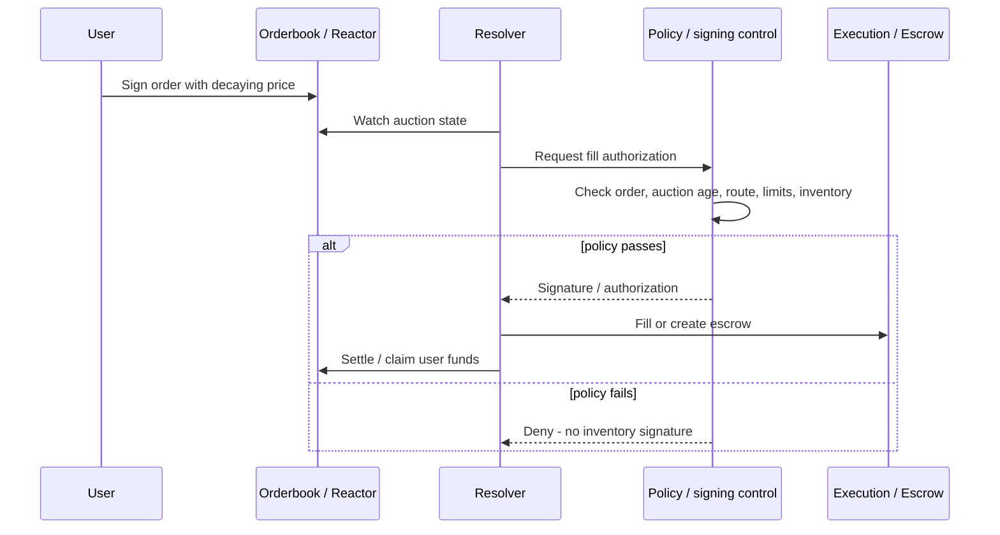
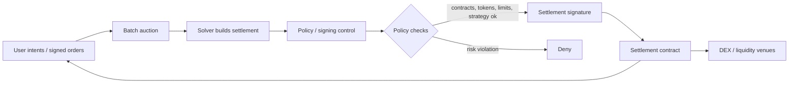
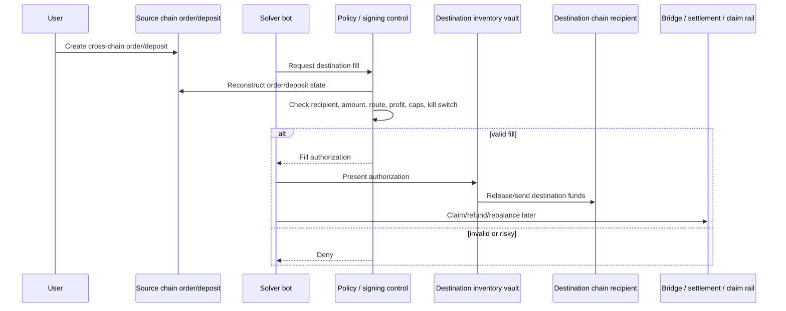
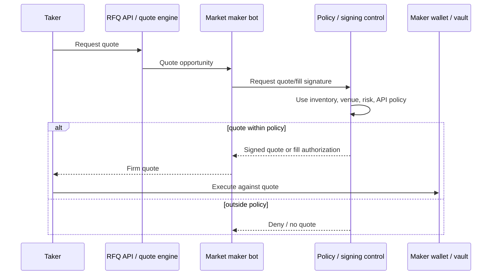
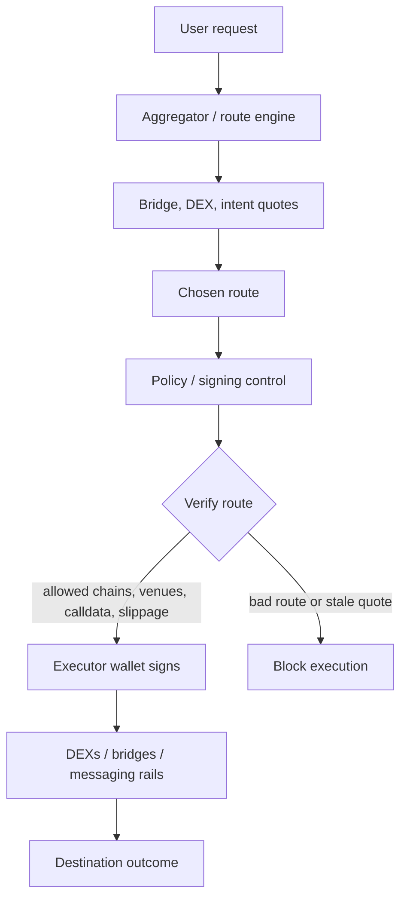
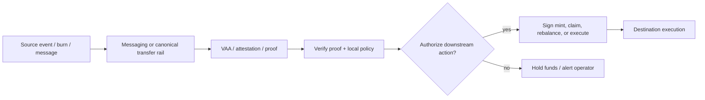

# Cross-Chain Solvers: Industry Market Map and Taxonomy

Status: draft v0.4
Date: 2026-06-01
Scope: industry report on cross-chain solvers, fillers, RFQ makers, intent protocols, aggregators, and solver-adjacent interoperability rails. Vendor-specific positioning is intentionally kept in the company profile files, not in this top-level market map.

## Executive summary

Cross-chain solvers are operators that accept a user intent/order on one domain and make the desired outcome happen on another domain, usually by fronting destination-chain liquidity, performing swaps/calls, and later reclaiming or settling value through a bridge, message layer, escrow, clearing layer, or canonical asset rail.

The market is converging around a few recurring execution patterns: Dutch-auction resolvers, batch-auction solvers, RFQ market makers, fast-fill relayers, intent routers, and settlement/rebalancing layers. These systems differ in naming and protocol mechanics, but they share a common economic shape: off-chain actors compete on price, speed, inventory depth, and reliability while protocols enforce repayment, settlement, or execution guarantees.

The most important operational questions are not only route quality or bridge security. Solver teams must also manage:

- where inventory sits while waiting to be filled, claimed, or rebalanced;
- which machines or services can sign inventory-moving transactions;
- whether quote/fill latency permits runtime policy checks;
- how source-chain orders, destination execution, and settlement claims are verified;
- whether onboarding is permissionless, allowlisted, or relationship-driven;
- which order formats are standardized versus protocol-specific;
- how solvers recover from incidents, stale quotes, bad fills, or bridge/message failures.

This report separates the industry taxonomy from vendor-specific recommendations. The top-level sections below describe how the market works. Company-specific notes, including potential integration ideas, live in the profile files:

- `plans/cross-chain-solver-p0-profiles.md`
- `plans/cross-chain-solver-p1-profiles.md`
- `plans/cross-chain-solver-outreach-tracker.csv`

## Core taxonomy

### 1. True cross-chain solver / filler networks

Definition: users create an order/intent; independent fillers/solvers/takers front destination liquidity or execution; solvers later claim, unlock, or settle source-side value.

Primary examples:

| Project | Company / ecosystem | Technique | Operational questions to verify |
|---|---|---|---|
| Across | Risk Labs / UMA ecosystem | Relayers fill destination quickly, then get repaid by optimistic settlement bundles through hub/spoke pools. ERC-7683 contributor. | How relayers custody inventory; latency budget for fill authorization; how exclusive relayer flows are operationalized. |
| deBridge DLN | deBridge | 0-TVL intent/order network. User locks source assets; takers/fillers fulfill destination leg; filler then claims/unlocks source assets. | Whether solver onboarding is fully self-serve; where reserve assets sit; how fill and claim keys are managed. |
| Wormhole Settlement | Wormhole Foundation/ecosystem | Intent settlement layer where solvers/fillers compete, often using Wormhole attestations plus products like Mayan Swift/MCTP. | Which solver roles are curated; how 3-second auctions affect policy checks; how drivers manage unlock/redeem keys. |
| Squid Coral / Squid Intents | Squid + Axelar | Intent swaps using solver flow, with Axelar providing GMP and cross-chain transport. | Whether solver-side participation is public or partner-only; where signed solver quotes are produced; who holds inventory. |
| Synapse Intent Network | Synapse | RFQ/relayer intent network with post-fill actions; sits alongside Synapse bridge/pool infra. | Current relayer/quoter/prover authorization model; separation of relay, prove, and claim roles. |
| Router Protocol OGA | Router Protocol | Omnichain graph architecture with bridges, DEXs, solvers, and messaging protocols as nodes/edges; route optimization and node registry. | Whether external nodes maintain reserves or execution keys; how node reputation and production onboarding work. |
| Relay.link | Reservoir / Relay ecosystem | Managed fast bridging/execution API; destination execution by Relay/liquidity providers, later rebalanced/settled. | Production solver/oracle onboarding; signer modes; where pre-positioned liquidity and withdrawal keys live. |
| 1inch Fusion+ | 1inch | Cross-chain Dutch-auction resolver system using source/destination escrows and hashlock/timelock style mechanics. | Resolver onboarding path; who holds escrow/fill keys; how maker secrets are generated, stored, and revealed. |

### 2. Solver DEXs and RFQ networks that matter for cross-chain

Definition: mostly same-chain intent/RFQ systems, but important because their solver/resolver architecture is being extended cross-chain or combined with bridge hooks.

| Project | Technique | Cross-chain relevance | Operational questions to verify |
|---|---|---|---|
| UniswapX | Dutch-auction signed orders filled by competing fillers through reactor contracts. | Cross-chain UniswapX extends the filler model across domains. | Which fillers hold inventory directly; how RFQ quoter requirements affect fill execution and signing latency. |
| CoW Protocol / CoW Swap | Batch auctions, solver competition, coincidence-of-wants, settlement contract. | Cross-chain UX via swap-and-bridge/hooks and potential solver integrations. | How solvers manage settlement keys, buffers, hooks, simulation, and production onboarding. |
| 1inch Fusion | Dutch-auction resolver network. | Fusion+ extends to cross-chain. | How resolver inventory, gas, escrow deployment, and secret reveal operations are controlled. |
| Hashflow | RFQ market-maker network with cryptographic quotes and professional makers. | Cross-chain swaps combine RFQ liquidity with messaging/bridging. | How makers protect quote-signing keys and inventory across chains. |
| Bebop | RFQ/PMM style DEX and API. | Multi-chain RFQ architecture is relevant to solver taxonomy even when not cross-chain-native. | How short-expiry quote signing and PMM inventory controls are operated. |
| Enso | Intent/shortcut execution network and route abstraction. | Can compose cross-chain DeFi routes and execution shortcuts. | Who signs validated routes and how simulation results map to production execution policy. |

### 3. Aggregators and chain-abstraction routers

Definition: systems that provide APIs/SDKs to route swaps, bridges, and calls across protocols. They may use solvers underneath or add an intent layer, but often they are not themselves the final economic solver.

| Project | Technique | Solver status | Operational questions to verify |
|---|---|---|---|
| LI.FI | Aggregates bridges, DEX aggregators, intent protocols, execution/status APIs. | Meta-router; also building/using intent and solver marketplace surfaces. | Whether permissionless solver docs reflect production access; where solver fill/finalise keys live. |
| Socket / Bungee | Chain-abstraction router, Socket Liquidity Layer, AppGateway/EVMx orchestration, EIP-7683 support. | Intent-capable orchestration infra; not primarily a liquidity solver marketplace. | How Bungee Auto execution is signed; whether external fillers/Transmitters hold inventory or gas exposure. |
| Squid | Router over Axelar plus intent products. | Hybrid: router plus Squid Intents/Coral solver flow. | Whether solver operation is partner-only; how signed solver quotes are generated and risk-managed. |
| Rango / Jumper-style frontends | Aggregation frontends over multiple bridges/DEXs. | Mostly route discovery/execution frontends, not solver networks themselves. | Whether the frontend operates any executor/relayer layer or only routes users to underlying protocols. |

### 4. Solver-adjacent bridge, messaging, and settlement rails

Definition: infrastructure that solvers use for settlement, messaging, token transfer, proof/attestation, or rebalancing. These are usually not solver marketplaces by themselves.

| Project | Category | Technique | Solver relevance |
|---|---|---|---|
| LayerZero | Messaging / OFT / Stargate | Endpoints, DVNs, executors; OFT token standard; Stargate unified liquidity pools. | Which actors operate DVNs/executors; whether solvers use Stargate only as a rail or also provide liquidity. |
| Stargate | Liquidity transport | Pools, credit allocation, taxi/bus modes. | Solver-adjacent liquidity rail. |
| Axelar | Messaging / GMP | Cross-chain gateway and General Message Passing. | Which solver products depend on Axelar messages and what confirmation/finality assumptions they make. |
| Wormhole Core / NTT / WTT | Messaging and token transfer | Guardian-signed messages, native token transfer/wrapped token transfer. | Infra rail; Wormhole Settlement is the solver-facing product. |
| Hyperlane | Messaging / Warp Routes | Mailbox, relayers, Interchain Security Modules, Warp Routes. | Which relayers/executors are operated by apps versus infrastructure providers; what signer exposure exists. |
| Chainlink CCIP | Messaging and programmable token transfer | DON-backed cross-chain messages and token transfers. | Settlement/transport rail. |
| Circle CCTP | Canonical USDC rail | Burn source USDC, mint destination USDC after attestation. | How solvers use CCTP for settlement/rebalancing and who controls attestation-driven mint/redeem operations. |
| Hop | Bonder bridge | Bonders front destination liquidity and settle via hTokens/AMMs. | Early solver-like liquidity fronting, narrower than generalized intents. |
| THORChain / Maya | Cross-chain AMM | Native-asset swaps through vaults/TSS and LP pools. | Not solver marketplaces; arbitrageurs and LPs are economically adjacent. |

### 5. Generalized intent infrastructure and research

Definition: systems building generalized intent languages, solver coordination, private execution environments, clearing layers, or new VMs.

| Project | Technique | Relevance to report | Questions for profile follow-up |
|---|---|---|---|
| Anoma | Generalized intent-centric architecture: users express intents; solvers compose compatible intents. | Long-term intent architecture and privacy/shielded solving. | Which parts are production-facing today versus research/protocol architecture. |
| Essential | Declarative/intents infrastructure and VM/protocol stack. | Long-term solver architecture. | How solver roles and production deployment timelines map to current intent systems. |
| Flashbots SUAVE | MEV/orderflow/private execution marketplace. | Solver/orderflow confidentiality and auction infrastructure. | How confidential orderflow and solver execution roles are exposed to application teams. |
| Khalani | Decentralized solver coordination / intent infrastructure. | Solver marketplace/coordination category. | Current product status, solver onboarding, and production role separation. |
| Everclear | Intent clearing and netting layer. | Reduces solver rebalancing cost by netting obligations across chains. | Which fast-path solver operations are operated by Everclear versus external solvers. |

## Techniques by category

### Dutch auctions

Used by UniswapX and 1inch Fusion/Fusion+. A signed order begins at a price favorable to fillers/resolvers and decays over time. Fillers compete by deciding when/if to fill.

Industry control questions:

- Who is allowed to fill during exclusive versus open auction windows?
- How are auction age, token, notional, venue, and profitability limits enforced?
- Which checks run before quoting versus before final fill execution?

### Batch auctions and combinatorial solving

Used by CoW Protocol. Orders are batched; solvers compete to produce the best aggregate settlement, often with coincidence-of-wants and DEX liquidity.

Industry control questions:

- Which component constructs settlement calldata, and which component signs it?
- How are solver buffers, hooks, internalization, and external liquidity venues constrained?
- How much time exists between solution selection and transaction deadline?

### Fast-fill then settle

Used by Across, deBridge DLN, Wormhole Settlement, Relay.link, Squid Coral, and Hop-like systems. Solver fronts destination funds, then later claims/refunds source-side value through settlement/bridge infrastructure.

Industry control questions:

- Where is destination inventory held, and which keys can move it?
- How does the solver verify the source order/deposit before filling?
- Which checks are latency-safe before fill versus deferred until claim/rebalance?

### RFQ and professional market makers

Used by Hashflow, Bebop, and parts of 0x/1inch-style ecosystems. Makers quote firm prices and fill against private/professional inventory.

Industry control questions:

- Which party signs quotes and how short are quote expiries?
- How do makers protect inventory thresholds, price models, and API credentials?
- How are quote validity, partial fills, and stale-price failures handled?

### Aggregation / route orchestration

Used by LI.FI, Socket/Bungee, Squid, Enso, and similar systems. The product is routing and execution over multiple protocols, sometimes with intent abstractions.

Industry control questions:

- Does the aggregator only return calldata, or does it operate executors/relayers?
- Who signs route execution, refunds, gas sponsorship, or deposit-address operations?
- How are routes constrained by chain, bridge, DEX, slippage, and calldata safety?

### Messaging and canonical transfer rails

Used by LayerZero, Axelar, Wormhole, Hyperlane, Chainlink CCIP, Circle CCTP, Stargate, and others.

Industry control questions:

- Is the rail a solver marketplace, a settlement path, or a message/token transport layer?
- Which actors run relayers/executors, and what signer or inventory risk do they carry?
- What proof, attestation, or finality condition must be verified before downstream execution?

## Operational risk and control patterns

Across the taxonomy, solver systems repeatedly expose the same control surfaces. This section is intentionally vendor-neutral; company-specific recommendations are kept in the profile files.

### 1. Inventory custody and hot-key exposure

Fast-fill relayers, RFQ makers, and resolvers often need funds available before source-side repayment or settlement. The report should distinguish:

- inventory held in EOAs, smart accounts, vault contracts, CEX accounts, or protocol balances;
- keys that can move inventory versus keys that only submit calldata;
- per-chain and per-token caps;
- emergency pause, withdrawal, and cold-wallet paths.

### 2. Order reconstruction and source-of-truth verification

Before a solver fills, signs, claims, or rebalances, it must decide which facts are canonical:

- source-chain deposit/order events;
- orderbook or API payloads;
- bridge attestations, VAAs, CCTP messages, or optimistic roots;
- quote IDs, exclusivity windows, deadlines, and replay protection;
- destination recipient, token, amount, and arbitrary call data.

### 3. Latency budget by phase

Not all solver actions have the same timing constraints. The report should separate:

- quote generation and auction bidding;
- destination fill submission;
- source claim/unlock/prove transactions;
- settlement finalization;
- rebalancing and withdrawal operations.

A runtime check that is too expensive for a 100-500 ms quoting path may still be appropriate before claim, settlement, withdrawal, or rebalancing.

### 4. Solver onboarding and competition model

The same term, “solver,” can mean very different operational arrangements:

- fully permissionless fillers;
- vetted RFQ quoters;
- bonded/allowlisted solvers;
- private market makers;
- internal or partner-only relayers;
- infrastructure nodes that do not take inventory risk.

Each company profile should verify where the project sits today, not just what the architecture permits.

### 5. Order format and standards compatibility

Order formats remain fragmented. Across and Socket have explicit ERC-7683 surfaces, while many other systems use protocol-specific order structs, RFQ payloads, escrow formats, or API routes. The report should ask each team:

- whether it supports ERC-7683 today;
- whether ERC-7683 support is planned;
- which fields must be preserved for security/economics;
- whether solvers can normalize policies across formats.

## Profile and outreach workflow

The report should read as an industry map first. Outreach should then ask companies to verify their profiles for accuracy before any vendor-specific conversation.

Recommended workflow:

1. Publish or share the industry taxonomy and company profile draft.
2. Ask each company to correct architecture, onboarding, custody, latency, and standards claims.
3. Record corrections in `plans/cross-chain-solver-outreach-tracker.csv`.
4. Only after technical validation, discuss whether any vendor-specific policy/custody architecture fits that team's actual operational model.

Draft neutral outreach language:

Subject: Cross-chain solver industry report — can you verify our section on {Company}?

Hi {Name},

We are putting together an industry report on cross-chain solvers, fillers, RFQ makers, intent protocols, and solver-adjacent interoperability rails. The goal is to explain how the systems work, where the categories differ, and what operational questions matter for teams running solver infrastructure.

We included a section on {Company}. Before publishing or circulating it more widely, we want to make sure we describe your architecture accurately. Would you or someone technical on your team be open to reviewing the section for correctness?

The specific areas we want to verify are onboarding model, solver/filler responsibilities, custody or signer assumptions, latency constraints, order format/standards support, and any public/private docs boundaries we should respect.

Thanks,
{Sender}

## Source URLs collected so far

### Solver / intent protocols

- Across cross-chain intents: https://docs.across.to/guides/concepts/crosschain-intents
- Across intents architecture: https://docs.across.to/guides/concepts/intents-architecture
- Across intent lifecycle: https://docs.across.to/guides/concepts/intent-lifecycle
- Across actors/relayers: https://docs.across.to/introduction/actors
- Across running relayer: https://docs.across.to/introduction/relayers/running-relayer
- deBridge DLN introduction: https://docs.debridge.com/dln-details/overview/introduction
- deBridge protocol overview: https://docs.debridge.com/dln-details/overview/protocol-overview
- deBridge order fulfillment: https://docs.debridge.com/dln-details/dln-specifics/order-fulfillment/order-fulfillment
- deBridge fulfilling order: https://docs.debridge.com/dln-details/dln-specifics/order-fulfillment/fulfilling-order
- deBridge claiming order: https://docs.debridge.com/dln-details/dln-specifics/order-fulfillment/claiming-order
- Wormhole Settlement overview: https://wormhole.com/docs/products/settlement/overview/
- Squid Intents: https://docs.squidrouter.com/api-and-sdk-integration/key-concepts/squid-aggregator/squid-intents
- Squid Coral Intent Swaps: https://docs.squidrouter.com/api-and-sdk-integration/coral-intent-swaps
- Squid become a solver: https://docs.squidrouter.com/api-and-sdk-integration/coral-intent-swaps/become-a-solver
- Synapse Bridge docs: https://docs.synapseprotocol.com/docs/Bridge
- Synapse Intent Network launch: https://docs.synapseprotocol.com/blog/synapse-intent-network-launch
- Router Protocol OGA overview: https://docs.routerprotocol.com/docs/about-oga/overview/
- Router Protocol OGA architecture: https://docs.routerprotocol.com/docs/about-oga/architecture/
- Relay docs: https://docs.relay.link/
- Relay quote API: https://docs.relay.link/references/api/get-quote
- 1inch Fusion+ introduction: https://business.1inch.com/portal/documentation/apis/swap/fusion-plus/introduction
- 1inch Fusion introduction: https://portal.1inch.dev/documentation/apis/swap/fusion/introduction

### Solver DEX / RFQ

- UniswapX overview: https://developers.uniswap.org/docs/liquidity/uniswapx/overview
- UniswapX auction types: https://developers.uniswap.org/docs/liquidity/uniswapx/concepts/auction-types
- UniswapX filling overview: https://developers.uniswap.org/docs/liquidity/uniswapx/filling/overview
- CoW intents: https://docs.cow.fi/cow-protocol/concepts/introduction/intents
- CoW solvers: https://docs.cow.fi/cow-protocol/concepts/introduction/solvers
- CoW fair combinatorial auction: https://docs.cow.fi/cow-protocol/concepts/introduction/fair-combinatorial-auction
- CoW competition rules: https://docs.cow.fi/cow-protocol/reference/core/auctions/competition-rules
- CoW swap and bridge: https://docs.cow.fi/cow-protocol/tutorials/cow-swap/swap-and-bridge
- Hashflow docs: https://docs.hashflow.com/hashflow
- Hashflow API v3: https://docs.hashflow.com/hashflow/taker/getting-started-api-v3
- Hashflow market making: https://docs.hashflow.com/hashflow/market-making/how-to-guides
- Bebop docs: https://docs.bebop.xyz/home
- Bebop API: https://docs.bebop.xyz/bebop/bebop-api
- Enso docs: https://docs.enso.build/home
- Enso shortcuts: https://docs.enso.build/pages/build/examples/shortcuts

### Aggregators and rails

- LI.FI introduction: https://docs.li.fi/introduction/introduction
- LI.FI architecture: https://docs.li.fi/introduction/lifi-architecture/system-overview
- LI.FI quote API: https://docs.li.fi/api-reference/get-a-quote-for-a-token-transfer
- Socket docs: https://docs.socket.tech/
- Socket architecture: https://docs.socket.tech/architecture/
- Socket EIP-7683: https://docs.socket.tech/eip7683/
- Bungee docs: https://docs.bungee.exchange/
- Axelar GMP overview: https://docs.axelar.dev/dev/general-message-passing/overview/
- LayerZero architecture: https://docs.layerzero.network/v2/concepts/layerzero-protocol-architecture
- LayerZero OFT quickstart: https://docs.layerzero.network/v2/developers/evm/oft/quickstart
- Stargate taxi/bus: https://stargateprotocol.gitbook.io/stargate/v2-developer-docs/integrate-with-stargate/modes-of-transport-taxi-and-bus
- Stargate credit allocation: https://stargateprotocol.gitbook.io/stargate/v2-developer-docs/integrate-with-stargate/credit-allocation-system
- Hyperlane relayer: https://docs.hyperlane.xyz/docs/protocol/agents/relayer
- Hyperlane ISM: https://docs.hyperlane.xyz/docs/protocol/ISM
- Hyperlane Warp Routes: https://docs.hyperlane.xyz/docs/protocol/warp-routes/warp-routes-overview
- Circle CCTP: https://developers.circle.com/cctp
- Chainlink CCIP: https://docs.chain.link/ccip/index
- Hop explainer: https://docs.hop.exchange/basics/a-short-explainer
- THORChain dev docs: https://dev.thorchain.org/
- Maya docs: https://docs.mayaprotocol.com/introduction/readme

### Generalized intent infra

- Everclear docs: https://docs.everclear.org/
- Everclear how it works: https://docs.everclear.org/concepts/how-it-works
- Everclear intents: https://docs.everclear.org/concepts/how-it-works/intents
- Anoma docs: https://docs.anoma.net/
- Essential docs: https://docs.essential.builders/
- Flashbots SUAVE essay: https://writings.flashbots.net/the-future-of-mev-is-suave
- Khalani site: https://khalani.network/

## Technique diagram additions for v0.2

The diagrams below are intentionally generic and can be reused in company profiles with protocol-specific labels substituted.

### Dutch auction / resolver fill



### Batch auction / solver settlement



### Fast-fill then settle



### RFQ / professional market maker



### Aggregator / route orchestration



### Messaging / canonical transfer rail used by solvers



## Company-specific vendor fit

Vendor-specific integration ideas are intentionally not part of the top-level industry report. They should live in the company profile files, where they can be tied to each protocol's actual architecture and verified with that team.

## Verification outreach and contact tracking schema

Use this table in the report or an issue tracker for verification status:

| Project | Category | Priority | Target contact/team | Contact source | Outreach owner | Status | Last touch | Next action | Architecture claims to verify | Custody/key questions | Latency/policy questions | Vendor-specific follow-up | Evidence/source links | Notes |
|---|---|---|---|---|---|---|---|---|---|---|---|---|---|---|
| Across / Risk Labs | Fast-fill solver network | P0 | TBD engineering/BD | TBD | TBD | Not started |  | Identify reviewer | Relayer fill + settlement lifecycle | Where relayer inventory keys live | What is the acceptable latency budget for additional policy checks? | See company profile | Existing report sources |  |

CSV column definitions:

| Column | Definition |
|---|---|
| `project` | Protocol/company/operator being verified. |
| `category` | Taxonomy bucket: fast-fill solver, RFQ, aggregator, rail, etc. |
| `priority` | Outreach priority: `P0`, `P1`, `P2`, or `Watchlist`. |
| `target_contact_team` | Person, team, Discord/TG handle, or role to contact. |
| `contact_source` | How the contact was found: intro, docs, website, prior relationship, conference, etc. |
| `outreach_owner` | Internal owner responsible for outreach and follow-up. |
| `status` | Current outreach/review state from the status values below. |
| `last_touch` | Date of last email/DM/call/comment. |
| `next_action` | Concrete next step and owner. |
| `architecture_claims_to_verify` | Claims in the report that need protocol confirmation. |
| `custody_key_questions` | Questions about hot keys, inventory custody, vaults, and signing authority. |
| `latency_policy_questions` | Questions about acceptable signing latency and feasible runtime checks. |
| `vendor_specific_follow_up` | Optional vendor-specific hypothesis or integration question to keep outside the neutral report. |
| `evidence_source_links` | Docs, source URLs, demo links, call notes, or correction links. |
| `notes` | Freeform notes, objections, or follow-up context. |

Ready-to-paste CSV header:

```csv
project,category,priority,target_contact_team,contact_source,outreach_owner,status,last_touch,next_action,architecture_claims_to_verify,custody_key_questions,latency_policy_questions,vendor_specific_follow_up,evidence_source_links,notes
```

Starter rows:

```csv
project,category,priority,target_contact_team,contact_source,outreach_owner,status,last_touch,next_action,architecture_claims_to_verify,custody_key_questions,latency_policy_questions,vendor_specific_follow_up,evidence_source_links,notes
Across / Risk Labs,Fast-fill solver network,P0,TBD engineering/BD,TBD,TBD,Not started,,Identify reviewer,Relayer fill + settlement lifecycle,Where relayer inventory keys live,What is the acceptable latency budget for additional policy checks?,See company profile,Existing report sources,
deBridge DLN,Fast-fill solver network,P0,TBD engineering/BD,TBD,TBD,Not started,,Identify reviewer,Order fulfillment and claim flow,Where taker/filler signing keys live,Which checks fit before fill vs before claim,See company profile,Existing report sources,
Wormhole Settlement / Mayan / MCTP,Settlement / solver ecosystem,P0,TBD engineering/BD,TBD,TBD,Not started,,Identify reviewer,Solver responsibilities and attestation flow,Where solver custody sits,Which VAA/CCTP checks are latency-safe,See company profile,Existing report sources,
```

Suggested status values:

```csv
Not started,Contact identified,Outreach sent,Follow-up sent,Review scheduled,Reviewed,Corrections needed,Approved,No response,Declined
```

Suggested priority values:

```csv
P0,P1,P2,Watchlist
```

## Open research questions for v0.2

The first pass on these questions is captured in `plans/cross-chain-solver-p0-profiles.md`, `plans/cross-chain-solver-p1-profiles.md`, and the outreach tracker in `plans/cross-chain-solver-outreach-tracker.csv`.

| Question | First-pass answer | Follow-up needed |
|---|---|---|
| Which projects have permissionless solver onboarding vs allowlisted/professional solver sets? | Across appears most permissionless; deBridge DLN docs describe an open solver market. Relay has public solver docs but coordinated production oracle/signer onboarding. Wormhole/Mayan, 1inch Fusion+, and Squid Coral appear curated, portal-gated, or partner/private for production solvers. | Ask each team to verify current production onboarding path and whether there is a private solver program. |
| Which teams/operators hold meaningful hot inventory versus only submit calldata? | Clear hot inventory: Across relayers, deBridge DLN solvers, Wormhole/Mayan drivers, 1inch Fusion+ resolvers, Relay solvers. Likely hot inventory: Squid Coral solvers. Integrator APIs may only surface calldata, but underlying solver/relayer still bears custody risk. | Confirm actual custody model and whether inventory is in EOAs, vaults, CEX accounts, smart accounts, or protocol balances. |
| Is 300-500 ms of additional policy/checking latency acceptable? | Likely plausible for destination fill signing in Across/deBridge/Relay if checks are efficient. Claims, unlocks, withdrawals, rebalances, oracle signing, and secret reveal paths likely tolerate more latency. Mayan's 3-second auctions and Squid's sub-5-second UX need careful hot-path design. | Ask teams which checks must run before bidding/filling vs which can run after fill, before claim, or during rebalance. |
| Which protocols have standardized order formats compatible with ERC-7683? | Across clearly supports ERC-7683. No primary-doc evidence found for ERC-7683 support in deBridge DLN, Wormhole/Mayan, 1inch Fusion+, Squid, or Relay. | Ask whether each team supports ERC-7683, plans to, or intentionally uses a protocol-specific order format. |
| Where do policy/custody controls naturally fit? | Across: relayer fill signer + inventory vault. deBridge: destination fill signer + source claim signer. Wormhole/Mayan: driver bid/fill/unlock signer + VAA/CCTP policy. 1inch: resolver escrow signer + maker secret custody. Squid: solver quote signer / inventory policy. Relay: solver fill signer + oracle signer + withdrawal/rebalance signer. | Validate whether each integration point is in the latency-critical path and what minimal policy checks are acceptable. |
| Which projects have public solver docs vs private partner programs? | Most public: Across, Relay, and deBridge protocol mechanics. Public architecture but private/curated onboarding: Wormhole/Mayan drivers, 1inch resolver production access, Squid solver side. | Ask for permission to cite any non-public corrections before publishing. |
| Who are likely BD/engineering contacts? | P0 tracker has initial public channels: Across `sales@across.to`; deBridge Discord/X; Mayan `support@mayan.finance`; 1inch Business Portal / `support@1inch.com`; Squid `support@squidrouter.com`; Relay `support@relay.link`. | Replace public channels with warm intros or named technical reviewers where the team has relationships. |

## Suggested next steps

1. Expand P2 / infrastructure profiles: LayerZero/Stargate, Axelar, Hyperlane, CCTP, CCIP, Hop, THORChain, Maya, Anoma, Essential, SUAVE, Khalani.
2. Customize the generic Mermaid diagrams above for priority company profiles.
3. Use `plans/cross-chain-solver-outreach-tracker.csv` to assign owners and send verification outreach to P0 prospects.
4. Keep any project-specific demo material outside the neutral industry report, or link it only from the relevant company profiles.
5. Keep vendor-specific integration ideas in the profile files and validate them only after each team confirms the industry-facing architecture summary.
