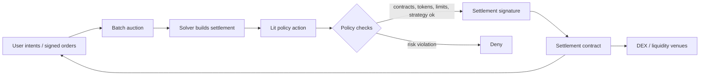
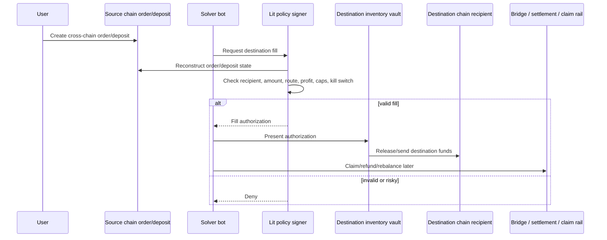
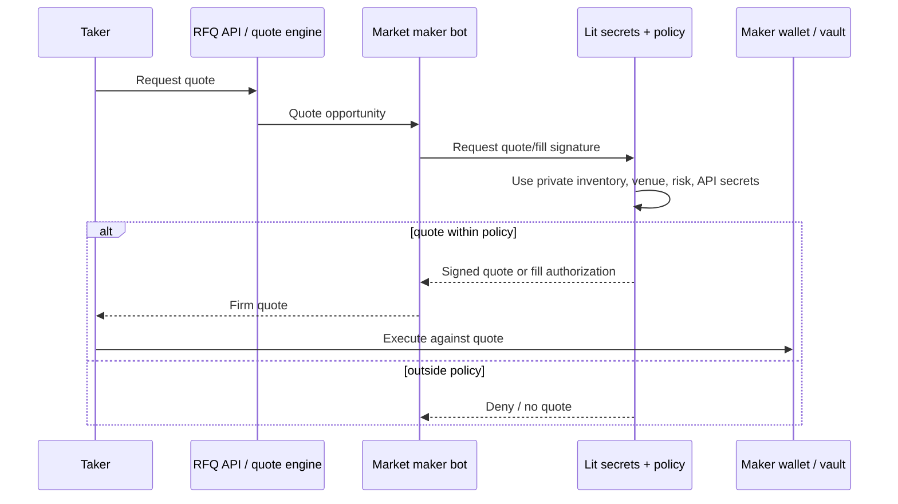
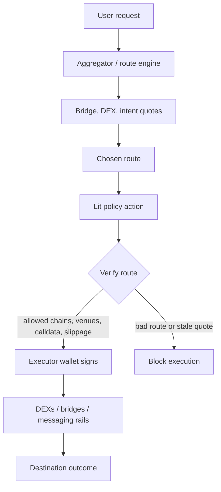
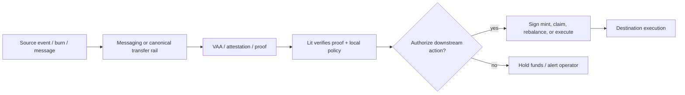

# Cross-Chain Solvers: Market Map, Taxonomy, and Lit Opportunity

Status: draft v0.1
Date: 2026-06-01
Repo context: Chipotle already includes a concrete `examples/lit-solver-vault/` implementation showing how Lit can protect solver/filler inventory with policy-gated signing.

## Executive summary

Cross-chain solvers are operators that accept a user intent/order on one domain and make the desired outcome happen on another domain, usually by fronting destination-chain liquidity, performing swaps/calls, and later reclaiming or settling value through a bridge, message layer, escrow, clearing layer, or canonical asset rail.

The common operational problem is not just routing. It is custody and policy enforcement around hot inventory. Solvers, fillers, relayers, RFQ market makers, and chain-abstraction routers often run bots that need fast access to capital and signing authority across many chains. That creates a high-value hot-key risk: compromise the solver machine and an attacker can drain inventory or execute valid-looking but malicious fills.

Lit can help by turning solver signing into policy-gated signing:

- Solver bot holds only a scoped Lit usage key.
- Solver inventory lives in a vault, exchange account, or dedicated wallet that only honors signatures from a Lit Action or PKP.
- The Lit Action reads source-chain orders, destination-chain state, private risk data, pricing data, compliance data, and kill-switch state before signing.
- The signature is produced only if the fill matches policy.
- The policy signer can be bound to the immutable Lit Action CID, so changing policy code changes the signer and cannot silently authorize funds.

Chipotle already has a strong proof point:

- `examples/lit-solver-vault/README.md` describes the threat model and solution.
- `examples/lit-solver-vault/action/solverPolicy.js` implements policy-gated fill authorization.
- `examples/lit-solver-vault/action/acrossPolicy.js` implements a live Across-style cross-chain fill policy.
- `examples/lit-solver-vault/contracts/SolverVault.sol` and `AcrossSolverVault.sol` hold inventory and verify Lit Action signatures.
- The README reports ~335-355 ms policy authorization on a live Across testnet path.

## Core taxonomy

### 1. True cross-chain solver / filler networks

Definition: users create an order/intent; independent fillers/solvers/takers front destination liquidity or execution; solvers later claim, unlock, or settle source-side value.

Primary examples:

| Project | Company / ecosystem | Technique | Notes for Lit |
|---|---|---|---|
| Across | Risk Labs / UMA ecosystem | Relayers fill destination quickly, then get repaid by optimistic settlement bundles through hub/spoke pools. ERC-7683 contributor. | Lit can protect relayer hot inventory, enforce deposit reconstruction, cap fills, pin SpokePool/RPC sources, and sign only valid fills. Chipotle already demos this pattern. |
| deBridge DLN | deBridge | 0-TVL intent/order network. User locks source assets; takers/fillers fulfill destination leg; filler then claims/unlocks source assets. | Lit can gate taker claim/fill signing, verify DLN order fields, enforce per-route risk and private pricing policies. |
| Wormhole Settlement | Wormhole Foundation/ecosystem | Intent settlement layer where solvers/fillers compete, often using Wormhole attestations plus products like Mayan Swift/MCTP. | Lit can protect solver keys while verifying Wormhole VAAs/attestations, CCTP state, quote economics, and destination execution. |
| Squid Coral / Squid Intents | Squid + Axelar | Intent swaps using solver flow, with Axelar providing GMP and cross-chain transport. | Lit can protect solver execution wallets and secrets while verifying Axelar state and route outcomes. |
| Synapse Intent Network | Synapse | RFQ/relayer intent network with post-fill actions; sits alongside Synapse bridge/pool infra. | Lit can enforce quote/fill policy and protect relayer funds. |
| Router Protocol OGA | Router Protocol | Omnichain graph architecture with bridges, DEXs, solvers, and messaging protocols as nodes/edges; route optimization and node registry. | Lit can be a solver custody layer for nodes/solvers and a policy engine for graph route execution. |
| Relay.link | Reservoir / Relay ecosystem | Managed fast bridging/execution API; destination execution by Relay/liquidity providers, later rebalanced/settled. | Lit can protect managed relayer inventory and enforce API-level fill policy. |
| 1inch Fusion+ | 1inch | Cross-chain Dutch-auction resolver system using source/destination escrows and hashlock/timelock style mechanics. | Lit can protect resolver inventory, sign escrow/fill actions only after policy checks, and hide resolver strategy/RPC secrets. |

### 2. Solver DEXs and RFQ networks that matter for cross-chain

Definition: mostly same-chain intent/RFQ systems, but important because their solver/resolver architecture is being extended cross-chain or combined with bridge hooks.

| Project | Technique | Cross-chain relevance | Notes for Lit |
|---|---|---|---|
| UniswapX | Dutch-auction signed orders filled by competing fillers through reactor contracts. | Cross-chain UniswapX extends the filler model across domains. | Lit can protect filler keys and inventory, enforce route/auction constraints, and separate bot from signing authority. |
| CoW Protocol / CoW Swap | Batch auctions, solver competition, coincidence-of-wants, settlement contract. | Cross-chain UX via swap-and-bridge/hooks and potential solver integrations. | Lit can protect solver settlement keys and private strategy inputs; less direct custody case if solver submits only settlement txs, stronger if solver fronts liquidity. |
| 1inch Fusion | Dutch-auction resolver network. | Fusion+ extends to cross-chain. | Lit can guard resolver funds and enforce loss/slippage/venue policy. |
| Hashflow | RFQ market-maker network with cryptographic quotes and professional makers. | Cross-chain swaps combine RFQ liquidity with messaging/bridging. | Lit can protect maker quote/fill signing, private inventory thresholds, and API keys. |
| Bebop | RFQ/PMM style DEX and API. | Multi-chain RFQ architecture is relevant to solver taxonomy even when not cross-chain-native. | Lit can protect PMM signing keys and policy around quote execution. |
| Enso | Intent/shortcut execution network and route abstraction. | Can compose cross-chain DeFi routes and execution shortcuts. | Lit can protect route executor keys and private solver strategy. |

### 3. Aggregators and chain-abstraction routers

Definition: systems that provide APIs/SDKs to route swaps, bridges, and calls across protocols. They may use solvers underneath or add an intent layer, but often they are not themselves the final economic solver.

| Project | Technique | Solver status | Notes for Lit |
|---|---|---|---|
| LI.FI | Aggregates bridges, DEX aggregators, intent protocols, execution/status APIs. | Meta-router; also building/using intent and solver marketplace surfaces. | Lit can help integrated solvers, route executors, and API operators with custody, policy, and key isolation. |
| Socket / Bungee | Chain-abstraction router, Socket Liquidity Layer, AppGateway/EVMx orchestration, EIP-7683 support. | Intent-capable orchestration infra; not primarily a liquidity solver marketplace. | Lit can sign app gateway/executor actions under policy and protect operator keys. |
| Squid | Router over Axelar plus intent products. | Hybrid: router plus Squid Intents/Coral solver flow. | Lit can protect solver route execution and secrets. |
| Rango / Jumper-style frontends | Aggregation frontends over multiple bridges/DEXs. | Mostly route discovery/execution frontends, not solver networks themselves. | Lit opportunity depends on whether they operate relayers/executors or partner solvers. |

### 4. Solver-adjacent bridge, messaging, and settlement rails

Definition: infrastructure that solvers use for settlement, messaging, token transfer, proof/attestation, or rebalancing. These are usually not solver marketplaces by themselves.

| Project | Category | Technique | Solver relevance |
|---|---|---|---|
| LayerZero | Messaging / OFT / Stargate | Endpoints, DVNs, executors; OFT token standard; Stargate unified liquidity pools. | Solvers route/settle over it; Lit can protect operators that execute messages or provide liquidity. |
| Stargate | Liquidity transport | Pools, credit allocation, taxi/bus modes. | Solver-adjacent liquidity rail. |
| Axelar | Messaging / GMP | Cross-chain gateway and General Message Passing. | Used by Squid and others; solvers can verify Axelar messages inside policy. |
| Wormhole Core / NTT / WTT | Messaging and token transfer | Guardian-signed messages, native token transfer/wrapped token transfer. | Infra rail; Wormhole Settlement is the solver-facing product. |
| Hyperlane | Messaging / Warp Routes | Mailbox, relayers, Interchain Security Modules, Warp Routes. | Solver-adjacent; Lit can be custom policy signer or executor key protection. |
| Chainlink CCIP | Messaging and programmable token transfer | DON-backed cross-chain messages and token transfers. | Settlement/transport rail. |
| Circle CCTP | Canonical USDC rail | Burn source USDC, mint destination USDC after attestation. | Common solver rebalance/settlement rail; Lit can gate attestation-driven mint/rebalance operations. |
| Hop | Bonder bridge | Bonders front destination liquidity and settle via hTokens/AMMs. | Early solver-like liquidity fronting, narrower than generalized intents. |
| THORChain / Maya | Cross-chain AMM | Native-asset swaps through vaults/TSS and LP pools. | Not solver marketplaces; arbitrageurs and LPs are economically adjacent. |

### 5. Generalized intent infrastructure and research

Definition: systems building generalized intent languages, solver coordination, private execution environments, clearing layers, or new VMs.

| Project | Technique | Relevance to report | Notes for Lit |
|---|---|---|---|
| Anoma | Generalized intent-centric architecture: users express intents; solvers compose compatible intents. | Long-term intent architecture and privacy/shielded solving. | Lit can be positioned as production-ready threshold/TEE policy signing for current solver operators. |
| Essential | Declarative/intents infrastructure and VM/protocol stack. | Long-term solver architecture. | Lit can complement as key custody and off-chain policy layer. |
| Flashbots SUAVE | MEV/orderflow/private execution marketplace. | Solver/orderflow confidentiality and auction infrastructure. | Lit can be complementary for solver key custody and policy signing. |
| Khalani | Decentralized solver coordination / intent infrastructure. | Solver marketplace/coordination category. | Lit can protect participating solver operators and policy-driven execution. |
| Everclear | Intent clearing and netting layer. | Reduces solver rebalancing cost by netting obligations across chains. | Lit can protect solvers that hold inventory while Everclear reduces rebalance frequency. |

## Techniques by category

### Dutch auctions

Used by UniswapX and 1inch Fusion/Fusion+. A signed order begins at a price favorable to fillers/resolvers and decays over time. Fillers compete by deciding when/if to fill.

Lit angle:

- Enforce max loss/min profit per auction.
- Check order fields and reactor/escrow addresses before signing.
- Gate fills by auction age, chain, token, notional, venue, and private inventory state.

### Batch auctions and combinatorial solving

Used by CoW Protocol. Orders are batched; solvers compete to produce the best aggregate settlement, often with coincidence-of-wants and DEX liquidity.

Lit angle:

- Protect solver settlement keys.
- Keep solver strategy/config private.
- Enforce policy over settlement contracts, token allowlists, and risk limits.

### Fast-fill then settle

Used by Across, deBridge DLN, Wormhole Settlement, Relay.link, Squid Coral, and Hop-like systems. Solver fronts destination funds, then later claims/refunds source-side value through settlement/bridge infrastructure.

Lit angle:

- This is the strongest near-term Lit wedge.
- Solver/filler inventory is exposed to hot bot compromise.
- Lit can remove inventory-moving keys from the bot and sign only validated fills.
- Policy can reconstruct source-chain orders/deposits before authorizing destination fills.

### RFQ and professional market makers

Used by Hashflow, Bebop, and parts of 0x/1inch-style ecosystems. Makers quote firm prices and fill against private/professional inventory.

Lit angle:

- Protect maker signing keys.
- Enforce private inventory thresholds and quote validity.
- Hide market-maker API keys and risk model credentials with Lit secrets.

### Aggregation / route orchestration

Used by LI.FI, Socket/Bungee, Squid, Enso, and similar systems. The product is routing and execution over multiple protocols, sometimes with intent abstractions.

Lit angle:

- Protect executor wallets.
- Sign route execution only if final route meets policy.
- Provide per-integrator / per-route scoped keys and auditability.

### Messaging and canonical transfer rails

Used by LayerZero, Axelar, Wormhole, Hyperlane, Chainlink CCIP, Circle CCTP, Stargate, and others.

Lit angle:

- Lit does not replace these rails.
- Lit can sit above them as policy-controlled signing/custody for operators using these rails.
- Policy can verify messages/attestations/events before signing downstream execution.

## How Lit can help solvers

### 1. Remove hot inventory keys from solver machines

Today many solvers need hot EOAs/API credentials that can move funds. Lit lets the bot request authorization without holding the signing key. The signer lives behind Lit threshold/TEE execution and only signs after policy checks.

Chipotle proof:

- `examples/lit-solver-vault/README.md` lines 12-21 define the compromised-bot inventory drain threat.
- `examples/lit-solver-vault/contracts/SolverVault.sol` verifies a policy signature before inventory moves.
- `examples/lit-solver-vault/action/solverPolicy.js` signs only validated fills.

### 2. Cross-chain policy as one source of truth

Smart accounts and on-chain policies are per-chain. Solvers often operate across 5-10+ chains. A Lit Action can be one policy that reads many chains and signs for vaults/wallets across chains.

Chipotle proof:

- `examples/lit-solver-vault/README.md` lines 61-66 makes this argument directly.
- `examples/lit-solver-vault/action/acrossPolicy.js` reads origin-chain Across deposit state and authorizes destination-chain fill execution.

### 3. Immutable policy identity via CID-derived signer

`Lit.Actions.getLitActionPrivateKey()` gives the executing action a deterministic key derived from the action CID. If code changes, the signer changes. Contracts can pin the original policy signer.

Chipotle proof:

- `examples/lit-solver-vault/README.md` lines 76-80.
- `docs/lit-actions/patterns.mdx` action-identity signing section.

### 4. Private strategy and secrets

Solvers have proprietary risk models, quote APIs, route preferences, RPC/API keys, inventory thresholds, and counterparty allowlists. Lit can decrypt/use these inside a policy action without exposing them to the bot.

Chipotle proof:

- `docs/lit-actions/secrets.mdx` describes PKP-backed encryption/decryption.
- `docs/lit-actions/patterns.mdx` describes PKP-as-data-vault and secure RPC URL patterns.

### 5. Runtime checks that are hard to put fully on-chain

Lit Actions can call APIs, read RPCs, compare multiple data sources, check compliance/risk, and evaluate rich JavaScript policy before signing.

Useful checks:

- Source-chain deposit/order exists.
- Recipient and amount match canonical order.
- Token/chain/settlement contract allowlists pass.
- Current inventory and private risk limits pass.
- Profit/slippage is acceptable.
- Sanctions/compliance checks pass.
- Kill switch not active.
- Deadline and replay protection pass.

### 6. Scoped usage keys and least privilege

Bot operators can receive a scoped Lit usage key that can only execute specific actions/groups, not manage the account or move arbitrary funds.

Chipotle proof:

- `examples/lit-solver-vault/scripts/setup.js` creates scoped usage keys.
- `docs/lit-actions/index.mdx` explains groups and action/PKP/API-key permissions.

## Company-by-company outreach posture

### Best immediate prospects

1. Across / Risk Labs
   - Why: Chipotle already has an Across-specific demo.
   - Pitch: policy-gated relayer inventory custody; compromised relayer bot cannot drain funds; ~335-355 ms authorization observed on testnet.
   - Ask them to validate: how Across relayers manage inventory and what policy constraints are most realistic.

2. deBridge DLN
   - Why: direct filler/taker order lifecycle with destination fulfillment and source claiming.
   - Pitch: Lit-gated taker/filler signing and private risk policy for DLN order fulfillment.
   - Ask them to validate: taker operational risks, claim/fill flow, where hot keys are used.

3. Wormhole Settlement / Mayan / MCTP ecosystem
   - Why: solver/filler settlement architecture and CCTP/Wormhole attestations fit Lit verification.
   - Pitch: policy-gated solver signing with VAA/CCTP/state verification.
   - Ask them to validate: solver responsibilities and where custody sits.

4. 1inch Fusion+ resolvers
   - Why: resolver inventory and escrow operations need fast signing.
   - Pitch: private resolver policy and hot-key isolation.
   - Ask them to validate: resolver trust/custody model and latency requirements.

5. Squid / Axelar Coral
   - Why: explicit solver/intents product plus message infra.
   - Pitch: protect solver wallets and route-execution authority while verifying Axelar route/message state.

6. Relay.link
   - Why: fast managed relay/filler model likely has operational inventory risk.
   - Pitch: policy-gated relay inventory and scoped execution keys.

### Secondary prospects

- LI.FI: strong distribution; likely partner/integrator or marketplace angle.
- Socket/Bungee: chain abstraction and EIP-7683 execution; potential executor/custody use case.
- Hashflow/Bebop: market maker key custody and private strategy protection.
- CoW Protocol/UniswapX: mature solver ecosystems; Lit angle strongest for fillers/resolvers with inventory exposure.
- Everclear: clearing layer; partner angle around solver risk/custody + netting.

## Draft outreach language

Subject: Cross-chain solver report — can you verify our section on {Company}?

Hi {Name},

We are putting together a detailed market report on cross-chain solvers/fillers/relayers: how the systems work, the operational models, and where key custody and policy enforcement become hard as teams scale across chains.

We included a section on {Company}. Before publishing, we want to make sure we describe your architecture accurately. Would you or someone technical on your team be open to reviewing the section for correctness?

The broader thesis is that solver operators increasingly need policy-gated signing: bots should be able to request fills, but should not hold the inventory-moving keys directly. Lit has built a working demo of this pattern, including an Across-style solver vault where a Lit Action reconstructs the source-chain order/deposit and signs the destination fill only if policy passes.

We would appreciate corrections, and if useful we can also show the Lit solver-vault demo and discuss whether the pattern maps to your solver/operator model.

Thanks,
{Sender}

## Source URLs collected so far

### Solver / intent protocols

- Across cross-chain intents: https://docs.across.to/guides/concepts/crosschain-intents
- Across intents architecture: https://docs.across.to/guides/concepts/intents-architecture
- Across intent lifecycle: https://docs.across.to/guides/concepts/intent-lifecycle
- Across actors/relayers: https://docs.across.to/introduction/actors
- Across running relayer: https://docs.across.to/introduction/relayers/running-relayer
- deBridge DLN introduction: https://docs.debridge.com/dln-details/overview/introduction
- deBridge protocol overview: https://docs.debridge.com/dln-details/overview/protocol-overview
- deBridge order fulfillment: https://docs.debridge.com/dln-details/dln-specifics/order-fulfillment/order-fulfillment
- deBridge fulfilling order: https://docs.debridge.com/dln-details/dln-specifics/order-fulfillment/fulfilling-order
- deBridge claiming order: https://docs.debridge.com/dln-details/dln-specifics/order-fulfillment/claiming-order
- Wormhole Settlement overview: https://wormhole.com/docs/products/settlement/overview/
- Squid Intents: https://docs.squidrouter.com/api-and-sdk-integration/key-concepts/squid-aggregator/squid-intents
- Squid Coral Intent Swaps: https://docs.squidrouter.com/api-and-sdk-integration/coral-intent-swaps
- Squid become a solver: https://docs.squidrouter.com/api-and-sdk-integration/coral-intent-swaps/become-a-solver
- Synapse Bridge docs: https://docs.synapseprotocol.com/docs/Bridge
- Synapse Intent Network launch: https://docs.synapseprotocol.com/blog/synapse-intent-network-launch
- Router Protocol OGA overview: https://docs.routerprotocol.com/docs/about-oga/overview/
- Router Protocol OGA architecture: https://docs.routerprotocol.com/docs/about-oga/architecture/
- Relay docs: https://docs.relay.link/
- Relay quote API: https://docs.relay.link/references/api/get-quote
- 1inch Fusion+ introduction: https://business.1inch.com/portal/documentation/apis/swap/fusion-plus/introduction
- 1inch Fusion introduction: https://portal.1inch.dev/documentation/apis/swap/fusion/introduction

### Solver DEX / RFQ

- UniswapX overview: https://developers.uniswap.org/docs/liquidity/uniswapx/overview
- UniswapX auction types: https://developers.uniswap.org/docs/liquidity/uniswapx/concepts/auction-types
- UniswapX filling overview: https://developers.uniswap.org/docs/liquidity/uniswapx/filling/overview
- CoW intents: https://docs.cow.fi/cow-protocol/concepts/introduction/intents
- CoW solvers: https://docs.cow.fi/cow-protocol/concepts/introduction/solvers
- CoW fair combinatorial auction: https://docs.cow.fi/cow-protocol/concepts/introduction/fair-combinatorial-auction
- CoW competition rules: https://docs.cow.fi/cow-protocol/reference/core/auctions/competition-rules
- CoW swap and bridge: https://docs.cow.fi/cow-protocol/tutorials/cow-swap/swap-and-bridge
- Hashflow docs: https://docs.hashflow.com/hashflow
- Hashflow API v3: https://docs.hashflow.com/hashflow/taker/getting-started-api-v3
- Hashflow market making: https://docs.hashflow.com/hashflow/market-making/how-to-guides
- Bebop docs: https://docs.bebop.xyz/home
- Bebop API: https://docs.bebop.xyz/bebop/bebop-api
- Enso docs: https://docs.enso.build/home
- Enso shortcuts: https://docs.enso.build/pages/build/examples/shortcuts

### Aggregators and rails

- LI.FI introduction: https://docs.li.fi/introduction/introduction
- LI.FI architecture: https://docs.li.fi/introduction/lifi-architecture/system-overview
- LI.FI quote API: https://docs.li.fi/api-reference/get-a-quote-for-a-token-transfer
- Socket docs: https://docs.socket.tech/
- Socket architecture: https://docs.socket.tech/architecture/
- Socket EIP-7683: https://docs.socket.tech/eip7683/
- Bungee docs: https://docs.bungee.exchange/
- Axelar GMP overview: https://docs.axelar.dev/dev/general-message-passing/overview/
- LayerZero architecture: https://docs.layerzero.network/v2/concepts/layerzero-protocol-architecture
- LayerZero OFT quickstart: https://docs.layerzero.network/v2/developers/evm/oft/quickstart
- Stargate taxi/bus: https://stargateprotocol.gitbook.io/stargate/v2-developer-docs/integrate-with-stargate/modes-of-transport-taxi-and-bus
- Stargate credit allocation: https://stargateprotocol.gitbook.io/stargate/v2-developer-docs/integrate-with-stargate/credit-allocation-system
- Hyperlane relayer: https://docs.hyperlane.xyz/docs/protocol/agents/relayer
- Hyperlane ISM: https://docs.hyperlane.xyz/docs/protocol/ISM
- Hyperlane Warp Routes: https://docs.hyperlane.xyz/docs/protocol/warp-routes/warp-routes-overview
- Circle CCTP: https://developers.circle.com/cctp
- Chainlink CCIP: https://docs.chain.link/ccip/index
- Hop explainer: https://docs.hop.exchange/basics/a-short-explainer
- THORChain dev docs: https://dev.thorchain.org/
- Maya docs: https://docs.mayaprotocol.com/introduction/readme

### Generalized intent infra

- Everclear docs: https://docs.everclear.org/
- Everclear how it works: https://docs.everclear.org/concepts/how-it-works
- Everclear intents: https://docs.everclear.org/concepts/how-it-works/intents
- Anoma docs: https://docs.anoma.net/
- Essential docs: https://docs.essential.builders/
- Flashbots SUAVE essay: https://writings.flashbots.net/the-future-of-mev-is-suave
- Khalani site: https://khalani.network/

## Technique diagram additions for v0.2

The diagrams below are intentionally generic and can be reused in company profiles with protocol-specific labels substituted.

### Dutch auction / resolver fill

```mermaid
sequenceDiagram
  participant User
  participant Orderbook as Orderbook / Reactor
  participant Resolver
  participant Lit as Lit policy signer
  participant Dest as Execution / Escrow

  User->>Orderbook: Sign order with decaying price
  Resolver->>Orderbook: Watch auction state
  Resolver->>Lit: Request fill authorization
  Lit->>Lit: Check order, auction age, route, limits, inventory
  alt policy passes
    Lit-->>Resolver: Signature / authorization
    Resolver->>Dest: Fill or create escrow
    Resolver->>Orderbook: Settle / claim user funds
  else policy fails
    Lit-->>Resolver: Deny; no inventory signature
  end
```

### Batch auction / solver settlement



### Fast-fill then settle



### RFQ / professional market maker



### Aggregator / route orchestration



### Messaging / canonical transfer rail used by solvers



## One-page Lit integration menu for solver teams

| Integration option | What Lit protects | Where it plugs in | Best fit | Proof / demo hook | Key validation questions |
|---|---|---|---|---|---|
| Policy-gated inventory vault | Destination-chain inventory and vault withdrawals | Vault contract, relayer wallet, or smart account module | Fast-fill solvers, relayers, managed bridge executors | `examples/lit-solver-vault/contracts/SolverVault.sol` | Which bot actions can move inventory? What is the maximum hot exposure per chain? |
| CID-derived policy signer | Policy immutability and signer rotation on code changes | Contracts or backends pin the Lit Action signer address | Teams that need auditable, non-silent policy upgrades | `getLitActionPrivateKey()` action-identity pattern | Who approves policy updates? Should signer changes require on-chain governance or multisig approval? |
| PKP-backed solver wallet | Cross-chain execution authority without raw private keys on the bot | EOA-like solver wallet, smart account owner, or executor key | Operators currently using hot EOAs/API signing keys | PKP signing + scoped permissions | Which chains/actions need the wallet? Are claims, fills, quotes, and rebalances separate keys? |
| Scoped usage keys | Least-privilege bot access to specific policies/actions | Bot runtime, CI/deploy system, solver worker fleet | Teams with many bots or delegated operators | Chipotle setup scripts for scoped usage keys | Can each bot be scoped by chain, action, notional, or strategy? How are keys revoked? |
| Private risk/strategy secrets | Inventory thresholds, API keys, route preferences, risk models | Lit Action encrypted secrets and policy runtime | RFQ makers, resolvers, proprietary routers | Lit secrets / PKP-as-data-vault patterns | Which data must remain hidden from bot hosts, contractors, or infra providers? |
| Multi-source verification | Source order state, destination state, bridge attestations, RPC/API quorum | Pre-sign checks in the Lit Action | Cross-chain fills where bad state causes loss | Across-style policy reconstructing source deposit | Which fields must be reconstructed before signing? Which RPC/API sources are trusted? |
| Emergency kill switch, caps, allowlists | Blast-radius controls during incidents or market stress | Policy config, contract allowlists, external status source | Any solver with meaningful inventory | Policy checks for caps, allowlists, deadlines | Who can trigger pause? Are caps global, per chain, per token, or per counterparty? |

## Verification outreach and contact tracking schema

Use this table in the report or an issue tracker for verification status:

| Project | Category | Priority | Target contact/team | Contact source | Outreach owner | Status | Last touch | Next action | Architecture claims to verify | Custody/key questions | Latency/policy questions | Lit fit hypothesis | Evidence/source links | Notes |
|---|---|---|---|---|---|---|---|---|---|---|---|---|---|---|
| Across / Risk Labs | Fast-fill solver network | P0 | TBD engineering/BD | TBD | TBD | Not started |  | Identify reviewer | Relayer fill + settlement lifecycle | Where relayer inventory keys live | Is 300-500 ms policy auth acceptable for fills? | Policy-gated relayer inventory vault | Existing report sources + Chipotle demo |  |

CSV column definitions:

| Column | Definition |
|---|---|
| `project` | Protocol/company/operator being verified. |
| `category` | Taxonomy bucket: fast-fill solver, RFQ, aggregator, rail, etc. |
| `priority` | Outreach priority: `P0`, `P1`, `P2`, or `Watchlist`. |
| `target_contact_team` | Person, team, Discord/TG handle, or role to contact. |
| `contact_source` | How the contact was found: intro, docs, website, prior relationship, conference, etc. |
| `outreach_owner` | Internal owner responsible for outreach and follow-up. |
| `status` | Current outreach/review state from the status values below. |
| `last_touch` | Date of last email/DM/call/comment. |
| `next_action` | Concrete next step and owner. |
| `architecture_claims_to_verify` | Claims in the report that need protocol confirmation. |
| `custody_key_questions` | Questions about hot keys, inventory custody, vaults, and signing authority. |
| `latency_policy_questions` | Questions about acceptable signing latency and feasible runtime checks. |
| `lit_fit_hypothesis` | Short statement of the likely Lit integration wedge. |
| `evidence_source_links` | Docs, source URLs, demo links, call notes, or correction links. |
| `notes` | Freeform notes, objections, or follow-up context. |

Ready-to-paste CSV header:

```csv
project,category,priority,target_contact_team,contact_source,outreach_owner,status,last_touch,next_action,architecture_claims_to_verify,custody_key_questions,latency_policy_questions,lit_fit_hypothesis,evidence_source_links,notes
```

Starter rows:

```csv
project,category,priority,target_contact_team,contact_source,outreach_owner,status,last_touch,next_action,architecture_claims_to_verify,custody_key_questions,latency_policy_questions,lit_fit_hypothesis,evidence_source_links,notes
Across / Risk Labs,Fast-fill solver network,P0,TBD engineering/BD,TBD,TBD,Not started,,Identify reviewer,Relayer fill + settlement lifecycle,Where relayer inventory keys live,Is 300-500 ms policy auth acceptable for fills?,Policy-gated relayer inventory vault,Existing report sources + Chipotle demo,
deBridge DLN,Fast-fill solver network,P0,TBD engineering/BD,TBD,TBD,Not started,,Identify reviewer,Order fulfillment and claim flow,Where taker/filler signing keys live,Which checks fit before fill vs before claim,Lit-gated taker/filler signing,Existing report sources,
Wormhole Settlement / Mayan / MCTP,Settlement / solver ecosystem,P0,TBD engineering/BD,TBD,TBD,Not started,,Identify reviewer,Solver responsibilities and attestation flow,Where solver custody sits,Which VAA/CCTP checks are latency-safe,Policy-gated solver signing with attestation verification,Existing report sources,
```

Suggested status values:

```csv
Not started,Contact identified,Outreach sent,Follow-up sent,Review scheduled,Reviewed,Corrections needed,Approved,No response,Declined
```

Suggested priority values:

```csv
P0,P1,P2,Watchlist
```

## Open research questions for v0.2

The first pass on these questions is captured in `plans/cross-chain-solver-p0-profiles.md` and the outreach tracker in `plans/cross-chain-solver-outreach-tracker.csv`.

| Question | First-pass answer | Follow-up needed |
|---|---|---|
| Which projects have permissionless solver onboarding vs allowlisted/professional solver sets? | Across appears most permissionless; deBridge DLN docs describe an open solver market. Relay has public solver docs but coordinated production oracle/signer onboarding. Wormhole/Mayan, 1inch Fusion+, and Squid Coral appear curated, portal-gated, or partner/private for production solvers. | Ask each team to verify current production onboarding path and whether there is a private solver program. |
| Which teams/operators hold meaningful hot inventory versus only submit calldata? | Clear hot inventory: Across relayers, deBridge DLN solvers, Wormhole/Mayan drivers, 1inch Fusion+ resolvers, Relay solvers. Likely hot inventory: Squid Coral solvers. Integrator APIs may only surface calldata, but underlying solver/relayer still bears custody risk. | Confirm actual custody model and whether inventory is in EOAs, vaults, CEX accounts, smart accounts, or protocol balances. |
| Is 300-500 ms Lit policy authorization acceptable? | Likely plausible for destination fill signing in Across/deBridge/Relay if checks are efficient. Claims, unlocks, withdrawals, rebalances, oracle signing, and secret reveal paths likely tolerate more latency. Mayan's 3-second auctions and Squid's sub-5-second UX need careful hot-path design. | Ask teams which checks must run before bidding/filling vs which can run after fill, before claim, or during rebalance. |
| Which protocols have standardized order formats compatible with ERC-7683? | Across clearly supports ERC-7683. No primary-doc evidence found for ERC-7683 support in deBridge DLN, Wormhole/Mayan, 1inch Fusion+, Squid, or Relay. | Ask whether each team supports ERC-7683, plans to, or intentionally uses a protocol-specific order format. |
| Where should Lit integrate? | Across: relayer fill signer + inventory vault. deBridge: destination fill signer + source claim signer. Wormhole/Mayan: driver bid/fill/unlock signer + VAA/CCTP policy. 1inch: resolver escrow signer + maker secret custody. Squid: solver quote signer / inventory policy. Relay: solver fill signer + oracle signer + withdrawal/rebalance signer. | Validate whether each integration point is in the latency-critical path and what minimal policy checks are acceptable. |
| Which projects have public solver docs vs private partner programs? | Most public: Across, Relay, and deBridge protocol mechanics. Public architecture but private/curated onboarding: Wormhole/Mayan drivers, 1inch resolver production access, Squid solver side. | Ask for permission to cite any non-public corrections before publishing. |
| Who are likely BD/engineering contacts? | P0 tracker has initial public channels: Across `sales@across.to`; deBridge Discord/X; Mayan `support@mayan.finance`; 1inch Business Portal / `support@1inch.com`; Squid `support@squidrouter.com`; Relay `support@relay.link`. | Replace public channels with warm intros or named technical reviewers where Chris/Lit has relationships. |

## Suggested next steps

1. Expand P1 profiles: UniswapX, CoW, LI.FI, Socket/Bungee, Synapse, Router OGA, Hashflow, Bebop, Enso, Everclear.
2. Customize the generic Mermaid diagrams above for priority company profiles.
3. Use `plans/cross-chain-solver-outreach-tracker.csv` to assign owners and send verification outreach to P0 prospects.
4. Convert Chipotle `examples/lit-solver-vault/` into a polished demo page for the report.
5. Validate the one-page Lit integration menu with solver teams and turn the strongest options into demo-specific calls to action.
